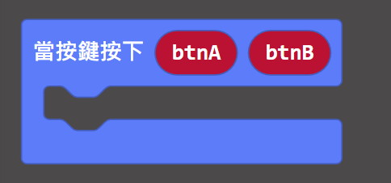
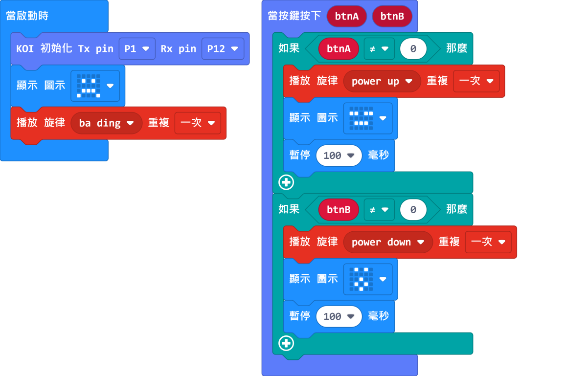

# **A與B鍵應用**

KOI上自帶兩個AB側按鍵與一個Reset按鍵。

 

## 編寫A,B按鍵程式

### 加載KOI插件：

### 在擴展頁直接搜尋KOI (KOI已經過微軟認證，可以直接搜尋)

### 你亦可以用插件地址搜尋

KOI插件：https://github.com/KittenBot/pxt-KOI

### [詳細方法](../../Makecode/powerBrickMC)

按鍵積木塊：

 

btn1和btn2分別指的是按鍵A與按鍵B的按鍵狀態。

當按鍵按下時，狀態為1，否則為0。通過判斷btnA或者btnB的變數是否為0時，就可判斷按鍵是否按下。

完整參考程式：

## 程式運行流程

把程式下載到Microbit上, 當按下KOI的按鍵A，Microbit點陣顯示笑臉，且蜂鳴器播放一個短曲 power up; 當按下KOI 的按鍵B，Microbit點陣顯示張嘴的表情，且蜂鳴器播放一個短曲 ba ding。

## 參考程式

[KOI AB 按鍵應用HEX (插件0.5.7)](https://makecode.microbit.org/_cjVL49CmfWKJ)

## 插件版本與更新

插件可能會不定時推出更新，改進功能。亦有時候我們可能需要轉用舊版插件才可使用某些功能。

詳情請參考: [Makecode插件版本更換](../../Makecode/makecode_extensionUpdate)

## FAQ

### 1: 為什麼我打開電源，按KOI的按鍵A或者按鍵B，怎麼沒反應？

·    答：打開電源後, KOI 及microbit 同時起動; 相對上, Microbit 所需的起動時間比KOI魔塊短, 引致 Microbit的初始化程式（串口指令中, 控制載入Yolo模型）已經跑完了，KOI還沒完全起動, 最後會在螢幕中呈現報錯資訊。

·    解決辦法：打開電源後，重新按下Microbit背後的Reset按鍵，讓Microbit重新開始運行（秘訣就是讓KOI魔塊先完全運行起來，再讓Microbit 跑初始化程式）

### 2: KOI鯉魚魔塊我直接3V電源可以嗎？

·    答：不行，必須要接5V！

