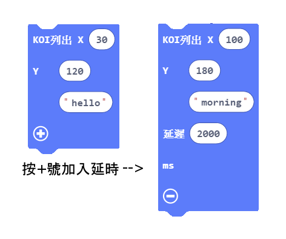
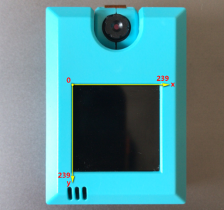
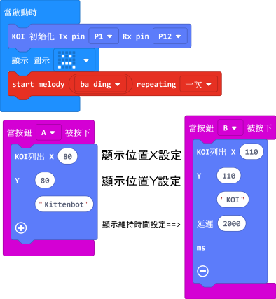

# **螢幕顯示自定資訊**

常規的英文字串可以顯示在KOI的螢幕上。但它有別於Microbit點陣屏顯示的字串，KOI螢幕資訊列印僅僅是作為輔助資訊。

## 编寫顯示資訊程式

### 加載KOI插件：https://github.com/KittenBot/pxt-koi

### [詳細方法](../../Makecode/powerBrickMC)

螢幕顯示積木塊：

 

在X, Y 空格上填上0-239 (參考下圖), 設定顯示資訊的起始位置

 

完整參考程式：

 

## 程式運行流程

把程式下載到Microbit上，按下Microbit的按鍵A，KOI螢幕上會顯示Kittenbot; 按下Microbit的按鍵B，KOI螢幕上會顯示KOI , 維持2秒。

## 參考程式

[螢幕顯示資訊HEX (插件0.5.7)](https://makecode.microbit.org/_haY9xhetabD6)

## 插件版本與更新

插件可能會不定時推出更新，改進功能。亦有時候我們可能需要轉用舊版插件才可使用某些功能。

詳情請參考: [Makecode插件版本更換](../../Makecode/makecode_extensionUpdate)

## FAQ

### 1: 為什麼螢幕顯示資訊，顯示一下就消失了。

·    答：因為KOI並沒有在同一個系統，螢幕畫面跟根據攝像頭資料不斷刷新的，因此字串顯示一瞬間後，就會消失。KOI螢幕只是作為攝像頭的的一個觀察視窗。如果想資訊長時間顯示。可以另接一個I2C的OLED屏。

### 2: 為什麼我打開電源，按KOI的按鍵A或者按鍵B，怎麼沒反應？

·    答：打開電源後, KOI 及microbit 同時起動; 相對上, Microbit 所需的起動時間比KOI魔塊短, 引致 Microbit的初始化程式（串口指令中, 控制載入Yolo模型）已經跑完了，KOI還沒完全起動, 最後會在螢幕中呈現報錯資訊。

·    解決辦法：打開電源後，重新按下Microbit背後的Reset按鍵，讓Microbit重新開始運行（秘訣就是讓KOI魔塊先完全運行起來，再讓Microbit 跑初始化程式）

### 3: KOI鯉魚魔塊我直接3V電源可以嗎？

·    答：不行，必須要接5V！

