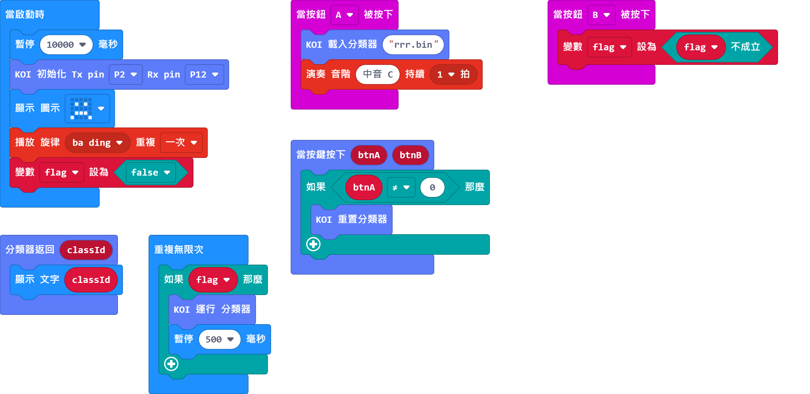
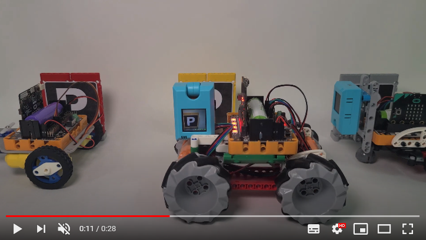

# **機器學習--自定義物件識別（物件辨識）**

在上一節教程，我們已經學習訓練物件辨識的模型，所以在本節教程我們將會學習如何利用模型進行物件辨識。

## 插入MicroSD卡

機器學習過程中訓練的圖像會暫存在SD卡，而且我們需要將訓練的模型儲存下來，所以使用機器學習時請確保SD卡已經插在卡槽。

## 編寫模型訓練程式

### 加載KOI插件：

### 在擴展頁直接搜尋KOI (KOI已經過微軟認證，可以直接搜尋)

### 你亦可以用插件地址搜尋

KOI插件：https://github.com/KittenBot/pxt-KOI

### [詳細方法](../../Makecode/powerBrickMC)

機器學習積木塊：

參考程式：

    模型儲存的格式可以為.bin或者.json
    例:aaa.json或aaa.bin

## 程式流程

1：將程式下載到Microbit。

2：按下A按鍵，載入訓練模型。

3：按下B按鍵運行分類器，開始進行識別。

4：將物件放在鏡頭前，Microbit點陣上會顯示辨識物件的分類編號。

## 參考短片

## 參考程式

[KOI 分類運行 HEX網址 (插件0.6.8)](https://makecode.microbit.org/_brxd3HUKCCxc)

## 插件版本與更新

插件可能會不定時推出更新，改進功能。亦有時候我們可能需要轉用舊版插件才可使用某些功能。

詳情請參考: [Makecode插件版本更換](../../Makecode/makecode_extensionUpdate)

## FAQ
### 1： 為什麼我重新開機，按下按鍵，但按鍵沒有反應？

·    答：打開電源後, KOI 及microbit 同時起動; 相對上, Microbit 所需的起動時間比KOI魔塊短, 引致 Microbit的初始化程式已經跑完了，KOI還沒完全起動, 因此按鍵沒有反應。

·    解決辦法：打開電源後，重新按下Microbit背後的Reset按鍵，讓Microbit重新開始運行（秘訣就是讓KOI魔塊先完全運行起來，再讓Microbit 跑初始化程式）

### 2： KOI鯉魚魔塊我直接3V電源可以嗎？

·    答：不行，必須要接5V！

### 3: 為什麼我在KOI固件版本v1.8.2上嘗試訓練分類器時，螢幕出現紅字警告，不能成功訓練分類器？

·    答：KOI還未重設分類器。

·    解決辦法：使用「重置分類器」這積木手動叫KOI重置分類器。（在參考程式中，編寫了按下KOI的A按鍵手動重置分類器的功能
