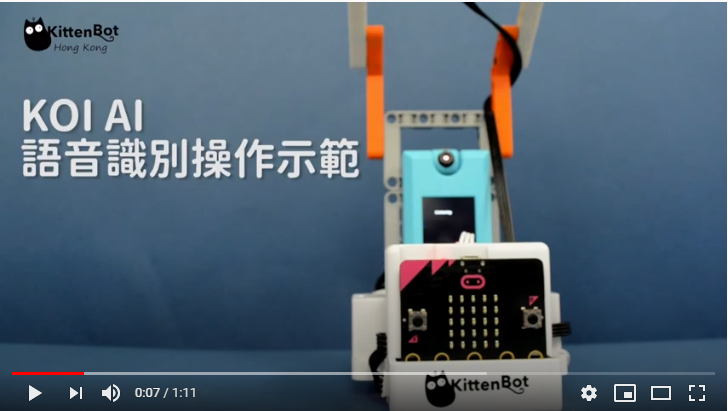

# **語音識別 (固件版本: v1.9.5或之後)**

我們可以訓練KOI聆聽語音指令。

## 編寫語音識別程式

### 加載KOI插件：

### 在擴展頁直接搜尋KOI (KOI已經過微軟認證，可以直接搜尋)

### 你亦可以用插件地址搜尋

KOI插件：https://github.com/KittenBot/pxt-KOI

### [詳細方法](../../Makecode/powerBrickMC)

語音識別積木塊：

編寫程式：

## 程式流程

1: 首先將程式下載到Microbit上。

2: 按下A，錄製第一段指令。錄製成功的話，KOI的畫面會顯示綠色，否則會顯示紅色。Microbit上會顯示語音指令編號。

3: 完成第一段錄音之後按下B，Microbit上的語音指令編號會增加。返回步驟2開始訓練下一段指令。

4: 重複步驟2-4，直至完成錄入所有指令。

        AI鏡頭支援最多10段語音。

5: 完成訓練後，同時按下A和B，KOI會開始辨識指令。成功辨認的話會顯示綠色，否則顯示紅色。Microbit上亦會顯示辨識到指令的編號。

## 參考程式

[1. 語音識別HEX網址(固件v1.9.5_插件0.5.7)](https://makecode.microbit.org/_aqCH640XxJu5)

## 語音識別示範短片

## 插件版本與更新

插件可能會不定時推出更新，改進功能。亦有時候我們可能需要轉用舊版插件才可使用某些功能。

詳情請參考: [Makecode插件版本更換](../../Makecode/makecode_extensionUpdate)

## FAQ

### 1： 為什麼我重新開機，按下按鍵A，但按鍵沒有反應？

·    答：打開電源後, KOI 及microbit 同時起動; 相對上, Microbit 所需的起動時間比KOI魔塊短, 引致 Microbit的初始化程式已經跑完了，KOI還沒完全起動, 因此按下A鍵沒有反應。

·    解決辦法：打開電源後，重新按下Microbit背後的Reset按鍵，讓Microbit重新開始運行（秘訣就是讓KOI魔塊先完全運行起來，再讓Microbit 跑初始化程式）

### 2： KOI鯉魚魔塊我直接3V電源可以嗎？

·    答：不行，必須要接5V！

