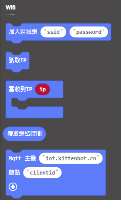

# **獲取網絡時間 (固件版本: v1.12.0或之後)**

連接Wifi後，KOI可以獲取到當前時間，做到報時的功能。

## 編寫物聯網程式

### 加載KOI插件：https://github.com/KittenBot/pxt-koi

### [詳細方法](../../Makecode/powerBrickMC)

物聯網積木塊：

編寫程式：

    網絡時間是一組列陣，時間的格式是：年、月、日、時、分、秒。
    而這程式為例，時間的索引第3項和第4項分別就是時和分了。
    
## 程式流程

1: 首先將程式下載到Microbit上。

2: 按下A，Microbit就會顯示當前的時間。(時區為GMT+8)

## 參考程式

[1. 獲取網絡時間HEX網址(固件v1.12.0_插件0.6.4)](https://makecode.microbit.org/_00TEM37w41MM)

## 插件版本與更新

插件可能會不定時推出更新，改進功能。亦有時候我們可能需要轉用舊版插件才可使用某些功能。

詳情請參考: [Makecode插件版本更換](../../Makecode/makecode_extensionUpdate)

## FAQ

### 1： 為什麼我重新開機，按下按鍵A，但按鍵沒有反應？

·    答：打開電源後, KOI 及microbit 同時起動; 相對上, Microbit 所需的起動時間比KOI魔塊短, 引致 Microbit的初始化程式已經跑完了，KOI還沒完全起動, 因此按下A鍵沒有反應。

·    解決辦法：打開電源後，重新按下Microbit背後的Reset按鍵，讓Microbit重新開始運行（秘訣就是讓KOI魔塊先完全運行起來，再讓Microbit 跑初始化程式）

### 2： KOI鯉魚魔塊我直接3V電源可以嗎？

·    答：不行，必須要接5V！
