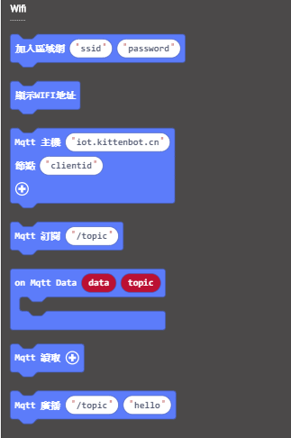

# **IoT物聯網 (固件版本: v1.9.5或之後)**

KOI上面也有Wifi的功能，我們可以透過Wifi存取物聯網平台的數據。

## 編寫物聯網程式

### 加載KOI插件：

### 在擴展頁直接搜尋KOI (KOI已經過微軟認證，可以直接搜尋)

### 你亦可以用插件地址搜尋

KOI插件：https://github.com/KittenBot/pxt-KOI

### [詳細方法](../../Makecode/powerBrickMC)

物聯網積木塊：

編寫程式：

### 此教程只是作為示範，請大家依你所用的平台填寫資料。

### ThingSpeak平台

有關ThingSpeak的教學可以參考： [ThingSpeak教學](../../Wifibrick/MakeCode/MC_TS)

### Makercloud創客雲平台

[創客雲介紹](../../Wifibrick/IoTPlatform/makercloud)

假如你使用Makercloud創客雲平台，可以參考： [創客雲教學](../../Wifibrick/MakeCode/makercloud)

## 程式流程

1: 首先將程式下載到Microbit上。

2: 按下A+B按鍵，等待KOI連接網絡，完成後Microbit上會顯示剔號。

    像手提電話一樣，連接Wifi網絡的名稱密碼，和MQTT伺服器的資料已經會儲存在KOI上面。
    所以不需要每次使用時都是用連接wifi網絡和MQTT的積木，只需要訂閱話題就可以了。

3: 按下A按鍵，由0至10隨機取數然後將數值傳上MQTT伺服器。

4: 按下B按鍵，讀取MQTT的上的數據。

5: 讀取到的數據(剛才我們傳上去的數字)就會顯示在KOI的屏幕上。

## 參考程式

[1. 物聯網HEX網址(插件0.6.8)](https://makecode.microbit.org/_4KXi32WvUE26)

## 插件版本與更新

插件可能會不定時推出更新，改進功能。亦有時候我們可能需要轉用舊版插件才可使用某些功能。

詳情請參考: [Makecode插件版本更換](../../Makecode/makecode_extensionUpdate)

## FAQ

### 1： 為什麼我重新開機，按下按鍵A，但按鍵沒有反應？

·    答：打開電源後, KOI 及microbit 同時起動; 相對上, Microbit 所需的起動時間比KOI魔塊短, 引致 Microbit的初始化程式已經跑完了，KOI還沒完全起動, 因此按下A鍵沒有反應。

·    解決辦法：打開電源後，重新按下Microbit背後的Reset按鍵，讓Microbit重新開始運行（秘訣就是讓KOI魔塊先完全運行起來，再讓Microbit 跑初始化程式）

### 2： KOI鯉魚魔塊我直接3V電源可以嗎？

·    答：不行，必須要接5V！
