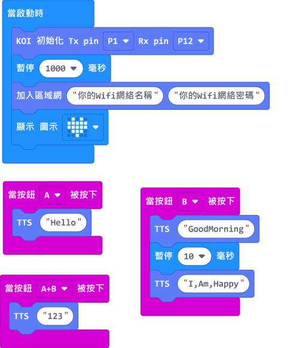

# **文字變語音 (固件版本: v1.9.5或之後)**

利用百度的雲AI，我們還可以做到文字轉語音(Text-To-Speech)的效果。

## 編寫人面辨識程式

### 加載KOI插件：https://github.com/KittenBot/pxt-koi

### [詳細方法](../../Makecode/powerBrickMC)

文字變語音積木塊：

編寫程式：

    文字變語音需要連接WIFI。假如你已經入網，之後不需要每次都運行入網的積木。

## 程式流程

1: 首先將程式下載到Microbit上。

2: 按A，KOI用英文說出 ”Hello” 。

3: 按B，KOI用英文說出 ”Good Morning”和”I am happy”。
    
    語音辨識支援短句子(2-3個單字)，並且單字之間不可有空格。

4: 按A+B，KOI用普通話說出 ”123”。

    MakeCode不支援中文，不過百度雲支援普通話，所以數字會以普通話讀出。

## 參考程式

[1. 文字變語音HEX網址(固件v1.9.5_插件0.5.7)](https://makecode.microbit.org/_H8JEtf7DR1D4)

## 插件版本與更新

插件可能會不定時推出更新，改進功能。亦有時候我們可能需要轉用舊版插件才可使用某些功能。

詳情請參考: [Makecode插件版本更換](../../Makecode/makecode_extensionUpdate)

## FAQ

### 1： 為什麼我重新開機，按下按鍵A，但按鍵沒有反應？

·    答：打開電源後, KOI 及microbit 同時起動; 相對上, Microbit 所需的起動時間比KOI魔塊短, 引致 Microbit的初始化程式已經跑完了，KOI還沒完全起動, 因此按下A鍵沒有反應。

·    解決辦法：打開電源後，重新按下Microbit背後的Reset按鍵，讓Microbit重新開始運行（秘訣就是讓KOI魔塊先完全運行起來，再讓Microbit 跑初始化程式）

### 2： KOI鯉魚魔塊我直接3V電源可以嗎？

·    答：不行，必須要接5V！

