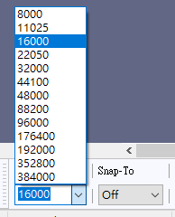
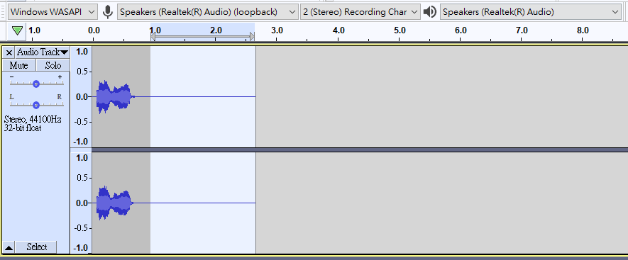

# 使用電腦製作KOI音頻檔

KOI可以播放電腦錄製的音頻檔，KittenBot推薦使用Audacity製作。

Audacity是個免費的聲音編輯軟件，支援錄製及修改等的功能。

## 安裝Audacity

前往<https://www.audacityteam.org/>，下載最新版本的Audacity。

## 網上免費文字轉語音平台

我們可以運用免費的TTS平台製作語音檔案。

[TTS平台](https://text-to-speech.imtranslator.net/speech.asp?dir=g_zh-HK_f)

## 使用Audacity

打開Audacity。

首先需要將專案速率設為16000Hz。

假如錄入電腦音效，選擇Speakers(loopback)。假如使用麥克風，選擇Microphone。

按REC開始錄音。

此時Audacity就會開始錄音，在TTS平台按Say It播放語音。

完成之後按停止錄音。

假如有需要可以修剪靜止部分。選擇想剪走的部分然後按Delete即可。

注意KOI對音頻檔案有限制，長度必須要是少於3.75秒。

由於KOI只支援單聲道音頻，需要將聲道分為2條。

按X刪除其中一條聲道。

匯出作wav檔案。

匯出後，請確保檔案的位元速率為256kbps。

