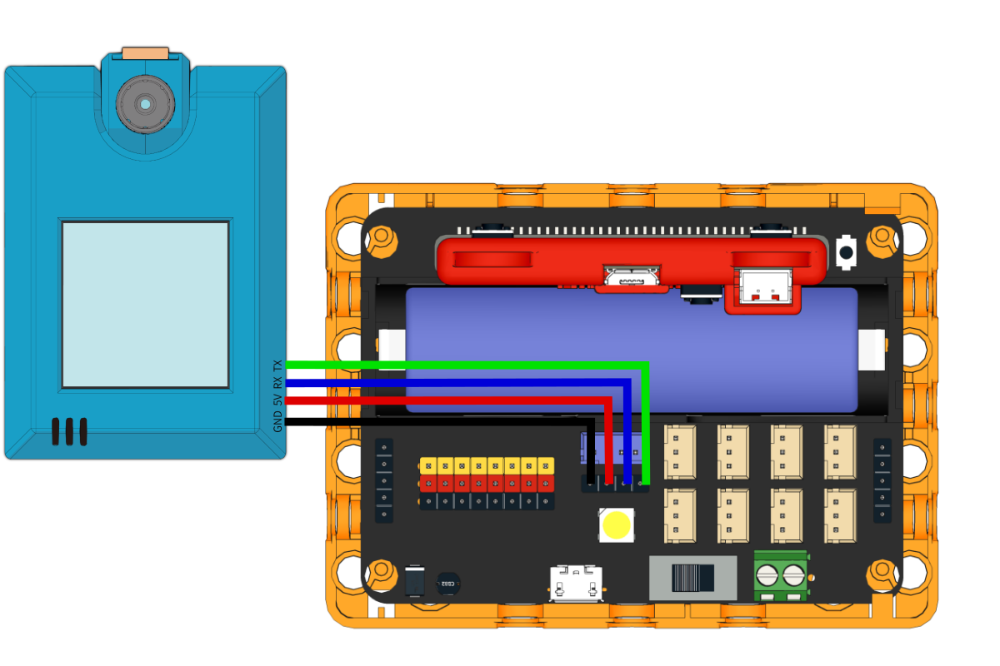
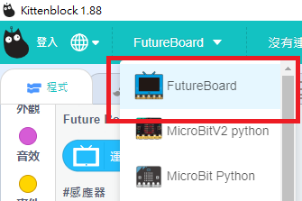
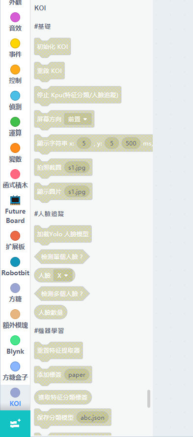
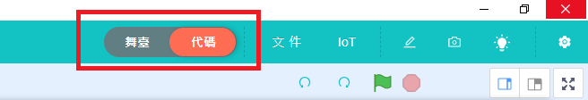
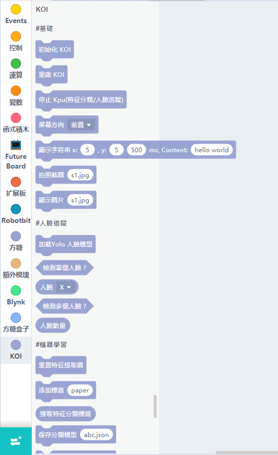
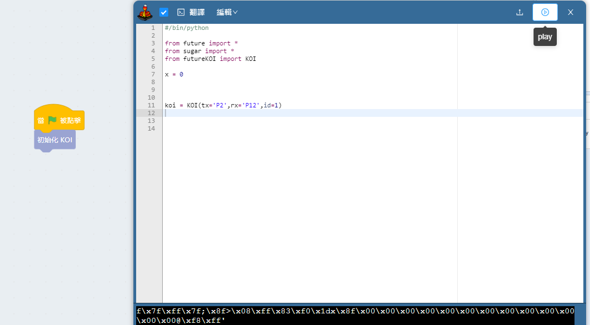
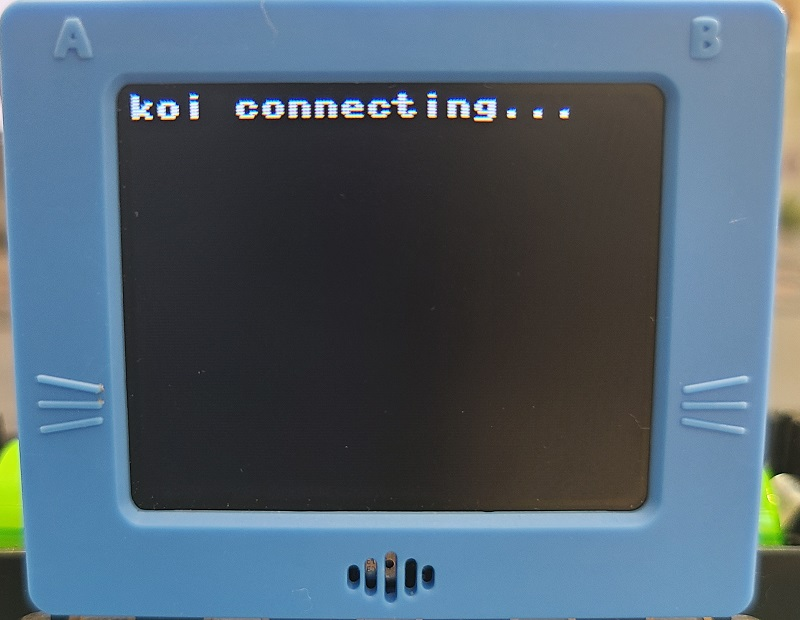
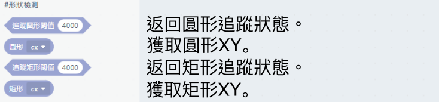
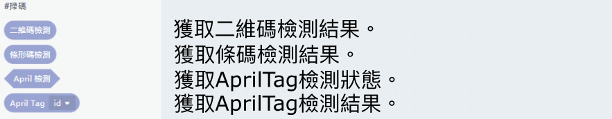
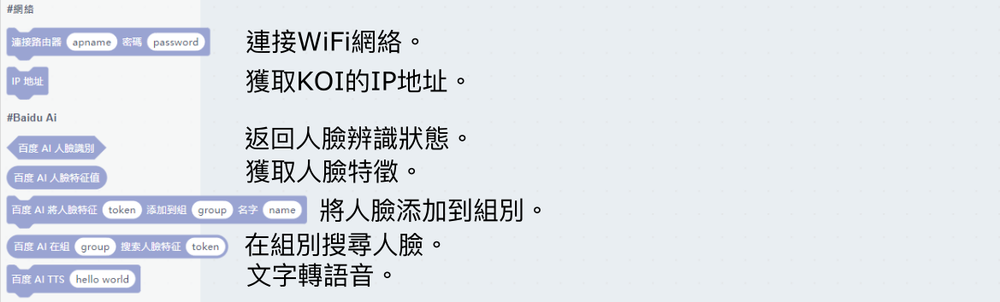

# 未來板與KOI使用快速入門

在未來板上使用KOI的應用下，推薦使用Robotbit Edu。

## 接線方法

將KOI連接到未來板的通訊接口上(P2, P12)。

## 在KittenBlock編程快速教學

在硬件欄選擇『未來板』。

## KOI積木欄

您可以看到KOI的積木都被灰掉了，並且不能拖曳出來使用，這是因為KOI的積木不能在舞台模式下運行。

切換到代碼模式。

在代碼模式之下，KOI的積木就不會灰掉，可以任意拖曳出來使用。

## 開始使用KOI

使用KOI前必須要先初始化。

未來板在連接KOI時，屏幕會顯示"koi connecting"。

## KOI編程快速教學

### 1. 基本操作

### 2. 人臉檢測

### 3. 圖像辨識

### 4. 顏色追蹤

### 5. 形狀追蹤

### 6. 掃碼

### 7. 網絡與百度雲

### 8. 語音相關

