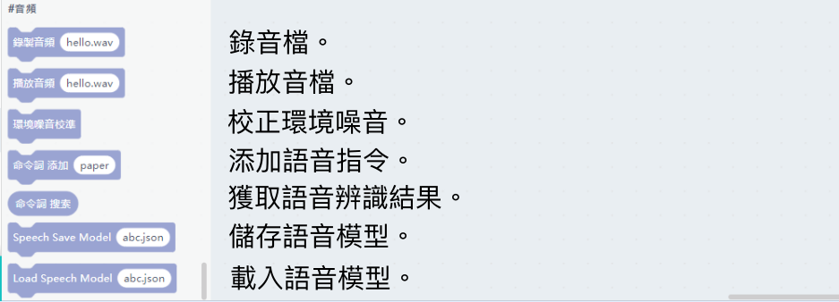
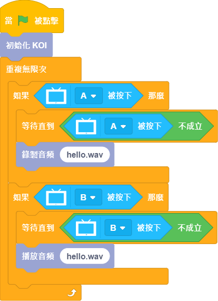
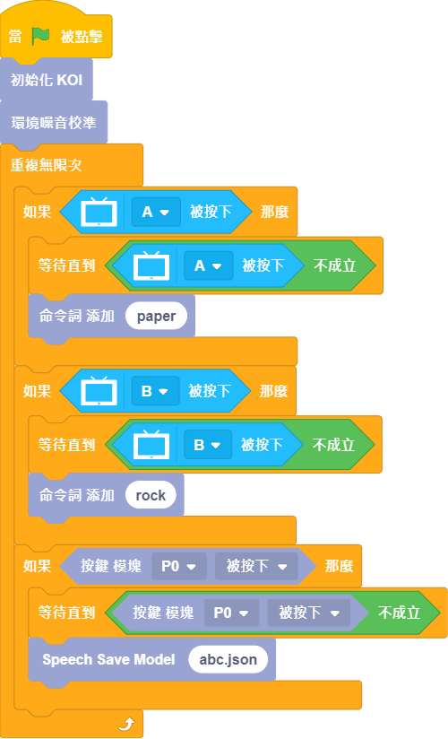
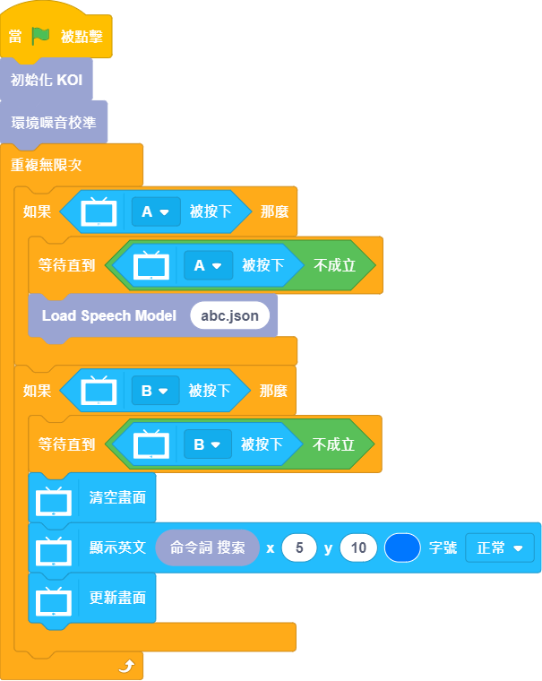

# 未來板KOI編程教學8：語音相關

KOI可以做到語音分類的功能。

## 語音相關積木塊

## 範例程式1：錄製音頻(需要SD卡)

## 範例程式2：語音模型訓練(需要SD卡)

    語音辨識前必須要運行環境噪音校正。
    錄入成功會顯示綠色，錄入不成功會顯示紅色。
    最多可以儲存10條語音指令。

## 範例程式3：語音辨識(需要SD卡)

    語音辨識前必須要運行環境噪音校正。
    錄入成功會顯示綠色，錄入不成功會顯示紅色。

