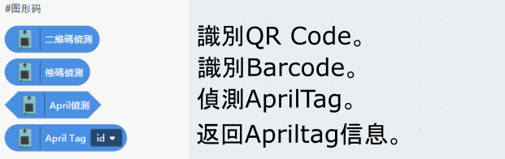

# KOI在KittenBlock編程快速開始

我們可以在Kittenblock對KOI編程，達致KOI與舞台的互動。

## 連接KOI

我們首先需要在Kittenblock與KOI建立連接。

#### 在硬件欄選擇KOI。

#### 點擊「連接硬件」或感嘆號連接KOI。

#### 點擊「開始連線」。

#### 連接成功。

#### 點擊顯示字串積木，KOI會即時有反應。

## KOI在KittenBlock編程

## 基本應用

### 示範程式

## 特徵分類器

### 示範程式

## 人臉追蹤

### 示範程式

## 幾何圖形識別

### 示範程式

## 顏色追蹤

### 示範程式

## 條碼識別

### 示範程式

## 語音辨識

### 示範程式

## IOT物聯網

### 示範程式

## 人臉辨識(需要網絡連線)

### 示範程式

## 疑難排解

### 1. 連接完KOI之後，點擊積木後KOI沒有反應。

#### 答：可能固件未更新，點擊上方的升級韌體即可。

### 2. KOI在Kittenblock中使用分類器時出現未定義報錯。

#### 答：未運行重置分類器。

### 3. KOI支援將程式上傳到KOI離線運行嗎？

#### 答：支援的。