# **快速入門**

## **連接Micro:bit**

### **1. 與Armourbit 連接**

因為接線系統上, Armourbit 相對簡易便捷; 小編推薦新手使用Armourbit, 這樣可以減少因接線失誤而導致白忙半天呢~

Armourbit與KOI配合使用時，KOI必須額外提供5V電。

用家不用擔心, 大家可以從Armourbit的電池盒, 以USB介面進行引出(如下圖)。

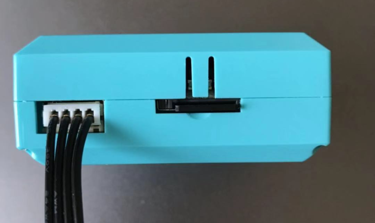  

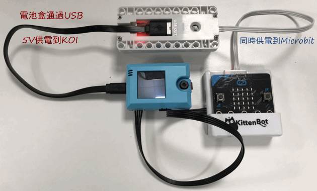  

### **2. 與Robotbit Edu連接**

由於Robobit Edu上提供了5V 的輸出接口, 我們可以不用再接USB線為KOI 供電。

Robotbit Edu上已經提供了4pin的通訊接口，我們只需要將KOI連接到通訊接口就可以了。

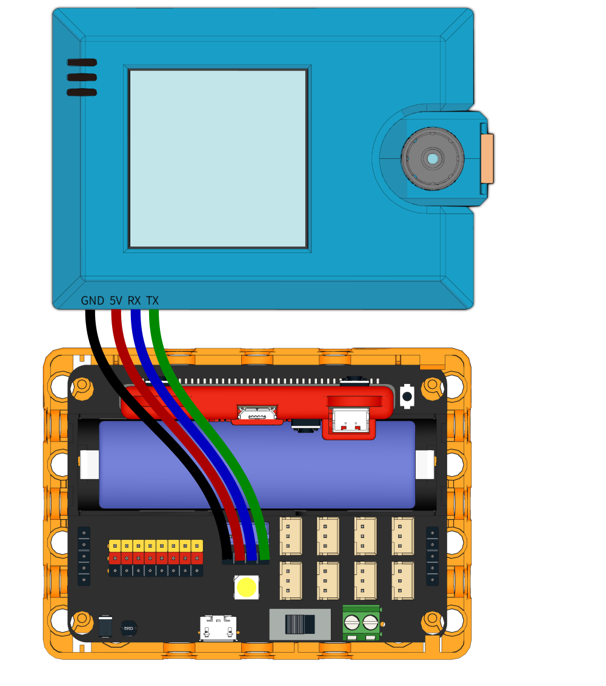

由於Robotbit Edu的通訊接口使用了P2與P12，我們在MakeCode裡面就要相應地選擇引腳。

### **3. 與Robotbit連接**

由於Robobit 上提供了5V 的輸出接口, 我們可以不用再接USB線為KOI 供電。

但用家必須**注意**, 在接駁4條杜邦線時, 要格外留意**5V** 及**GND** 的插線, 

##### xxx **切勿反接** xxx

否則KOI有機會不能再運作了 >.<

使用隨盒附送的4pin 線, 白色大插頭插入KOI 中

另一端顏色順序為 - 黑, 紅, 藍, 綠

分別對應Robotbit 上 - GND, 5V, P1(TX), P12(RX)

    KOI的藍色線只可以接類比引腳（Pin0-2）！使用Pin0的話請拔除蜂鳴器跳線帽。

 

#### 重要事項: 黑 (GND) 及 紅(5V) 切勿反接!!!

再次*檢查接線無誤* 後, 就可以打開Robitbit 的開關, 便會看到KOI 的屏幕顯示出鏡頭當下所拍到的畫面。

 

 

## **準備Makecode編程**

------

可以使用線上版本的Makecode

[https://makecode.microbit.org](https://makecode.microbit.org/)

  

### **加入插件 (extension)**

------

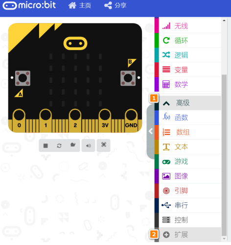  

把以下連結copy & paste 到Makecode 上：

#### **https://github.com/KittenBot/pxt-koi**

KOI 插件成功載入，如圖所示                                                                       

​                                                              

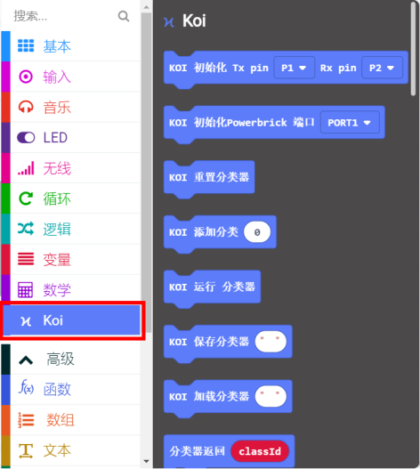  

## **積木介紹**

------

### **連接初始化**

​    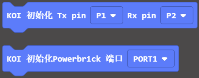  

**第一個積木**——針對是Robotbit或者其它Microbit擴展板

**第二個積木**——針對是能量魔塊的Armourbit，新手推薦使用能量魔塊套件

### **Classifier 分類器**

如果大家熟悉PC端的KittenbotML5外掛程式，那麼理解KOI的Classifier 積木塊也就很簡單了。

Classifier 分類器用於自訂學習分辨特定的物體或者場景等等。

 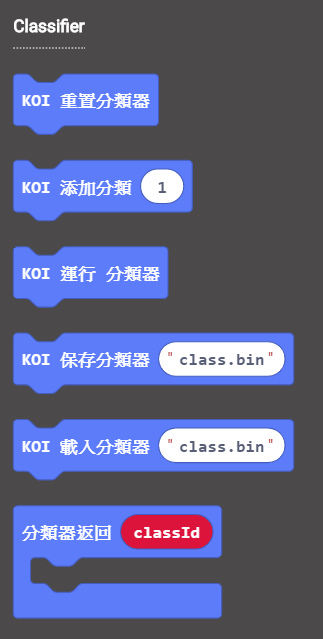 

### **截圖與顯示**

使用此功能前，先檢查記憶體卡是否已經插在KOI魔塊上，否則截圖無法保存。

調用截圖積木塊，會以“XXX.png”存儲一張圖片到記憶體卡中 (XXX 為自定義字無空隔字串)。**如無記憶體卡，顯示截圖失敗！**

調用顯示積木塊，會在記憶體卡中尋找一張以“XXX.png”為名的圖片，並以顯示，顯示持續1S左右。若記憶體卡中無此圖片，則螢幕回饋資訊無法無法打開此檔。

 

### **顯示資訊**

使用列出積木，可在螢幕指定的x, y 上顯示資訊; 資訊顯示約1秒後便會自動消失。

我們也可按需要加入延時, 加長資訊顯示時間。

  

### **設置螢幕顯示**

前置(Front), 後置(Back)及平放(Land) 3種選擇，因為模組無法自動檢測當前攝像頭是前置或者後置的狀態。因此需要手動選擇設置, 螢幕會根據選擇進行畫面翻轉處理。

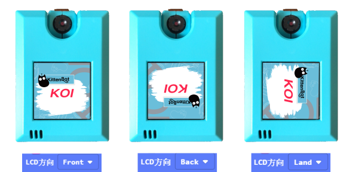 

### **圓形追蹤**

閾值越大，排除干擾越強，但閾值太大，圓形檢測會越難。

x與y為檢測圓形在螢幕上的橫縱坐標，r為檢測所得之圓形半徑。

 

### **方形追蹤**

與圓形追蹤功能同理

w與h為檢測矩形時，屏幕上框選出方形的線框長度與寬度。

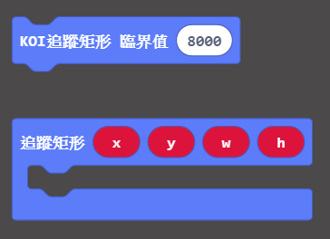 

### **顏色巡線與顏色追蹤**

顏色巡線與顏色追蹤前，必須進行顏色校準

視覺巡線對應的座標是直線段的兩點座標（x1，y1）（x2，y2）

色塊參數與矩形追蹤同理

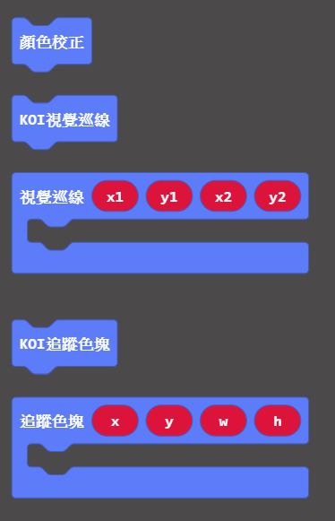 

### **二維碼**

掃描檢測二維碼，返回二維碼結果。

二維碼寬度要求不小於3.5cm，一般微信名片二維碼大於3.5cm。若二維碼太小，會因解析度太小的原因無法識別。

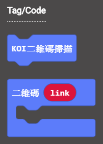 

### **條碼**

掃描檢測條碼，返回條碼結果

條碼要求不小於3.5cm。若條碼太小，會因解析度太小的原因無法識別。

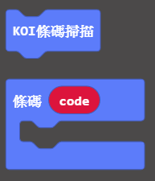 

### **Apriltag**

Apriltag簡單理解為簡化版的二維碼，Apriltag還能監測出座標與其三軸的旋轉角度。

Apriltag廣泛應用到機器人視覺識別的場景中

 

### **人臉模型yolo檢測**

 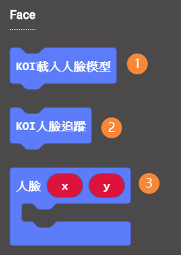 

1. 初始化時載入人臉模型後, 才能啟動人臉追蹤功能。

2. 啟動人臉追蹤功能，檢測到人臉即返回人臉座標xy。

3. 當檢測到人臉，返回人臉的座標。

### **錄製與播放音訊**

 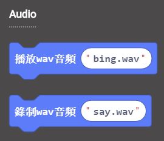

由於錄製的wav 檔是儲存在micro SD 卡中, 播放功能亦是由記憶卡讀取wav檔, 因此使用時要求在KOI開機前,  記憶體卡已經插好，否則不能進行錄音與播放。

**記憶體卡不支援hot plug，請在啟動KOI前插好記憶卡**

### **KOI的AB按鍵檢測**

 

按鍵檢測事件，btn1與btn2分別是按鍵的狀態值; 當按下鬆開會傳回迅間值1，閒置狀態為0。

## **插件版本與更新**

KOI插件可能會不定時推出更新，改進功能。亦有時候我們可能需要轉用舊版插件才可使用某些功能。

詳情請參考: [Makecode插件版本更換](../Makecode/makecode_extensionUpdate)