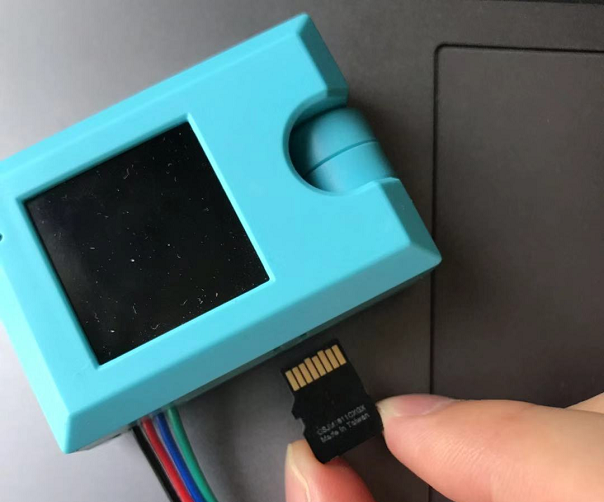

# KOI MicroPython編程快速入門(需要SD卡)

KOI也支援使用MicroPython編程，詳情請參考本教程。

## 編程方法1：KittenBlock編程

### 1. 在KittenBlock連接KOI。

[詳細教學](../kittenblock/kittenblock)

### 2. 用KittenBlock的Python編輯器編程。

## 編程方法2：KittenCode編程

[詳細教學](../../KittenCode/interface)

## 編程方法3：任何Python編輯器

### 1. 將SD卡插入KOI然後開機。

### 2. 將SD卡插入電腦，你會在SD卡上看見一個boot.py的檔案。

### 2.1 或者你可以直接在SD卡新增boot.py檔案，寫入以下代碼。

    from fpioa_manager import *
    from koi import *
    # bootup comm code

### 3. 新增一個main.py檔案，在main.py編程。