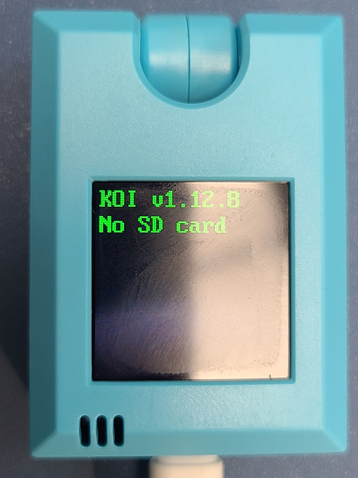
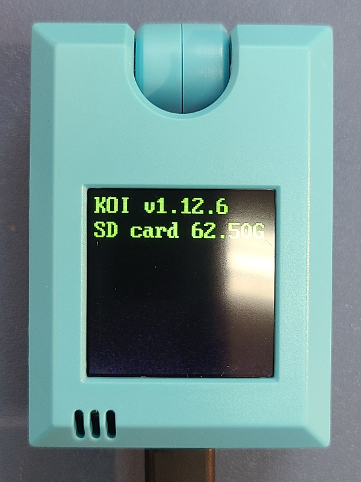
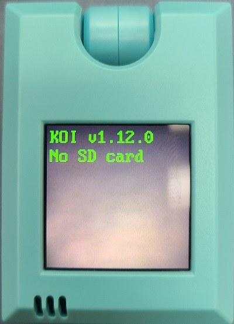
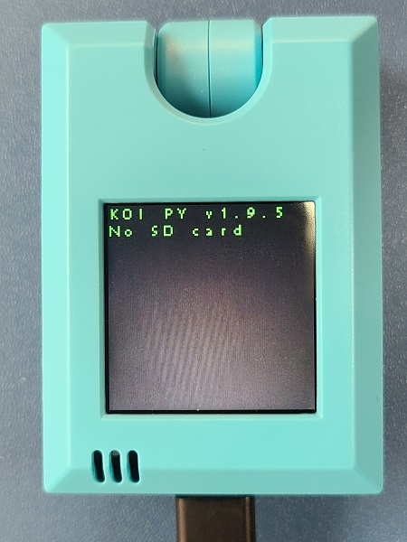
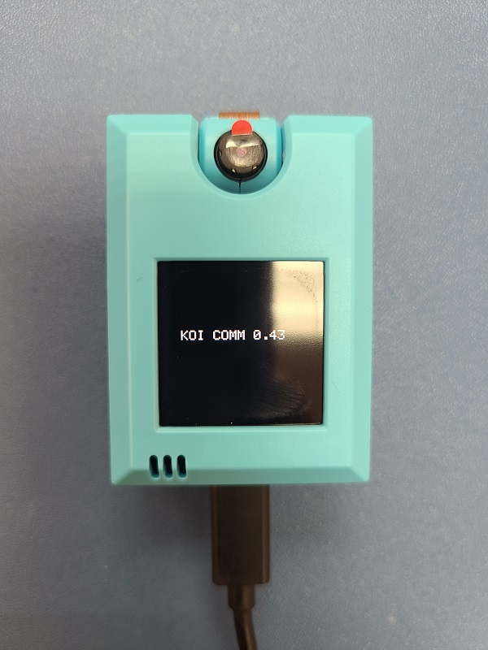

# **KOI固件版本一覽**

這裡集合了KOI最新與過往的固件檔案。

## 最新固件(版本v1.13.1)

固件版本: v1.13.1

固件日期：19/10/2022

[下載地址](https://bit.ly/KOIFW1131)

固件更新摘要：

1. 修正TTS API問題

開機畫面：

版本提示：

### 固件版本v1.12.8

固件版本: v1.12.8

固件日期：27/10/2021

[下載地址](https://bit.ly/KOIFW1128)

固件更新摘要：

1. 修正MQTT登入問題

開機畫面：

版本提示：

## 固件版本v1.12.6

固件版本: v1.12.6

固件日期：20/03/2021

[下載地址](http://bit.ly/KOIFW1126)

固件更新摘要：

1. 提升KOI穩定性

開機畫面：

版本提示：

##  固件版本v1.12.0

固件版本: v1.12.0

固件日期：23/11/2020

[下載地址](https://bit.ly/KOIFW1120)

固件更新摘要：

1. 改善文字變語音穩定性
2. 人臉辨識功能改善
3. 語音辨識功能改善
4. 用戶界面改善

開機畫面：

版本提示：

## 版本v1.9.5

固件版本: v1.9.5

固件日期：16/09/2020

[下載地址](http://bit.ly/KOIFW195)

固件更新摘要：

1. IOT功能更新
2. 語音辨識功能更新
3. 機器學習模型數目由20增加到40

開機畫面：

版本提示：

## 固件版本0.43

固件版本: 0.43

固件日期：16/09/2020以前

[下載地址](http://bit.ly/KOIFW043)

固件更新摘要：

1. KOI出廠時原廠固件

版本提示：

## 如何檢查KOI現時版本

KOI開機時也會顯示。

只需要打開Kittenblock，連接KOI，連接成功時畫面就會彈出訊息提示KOI固件版本。

