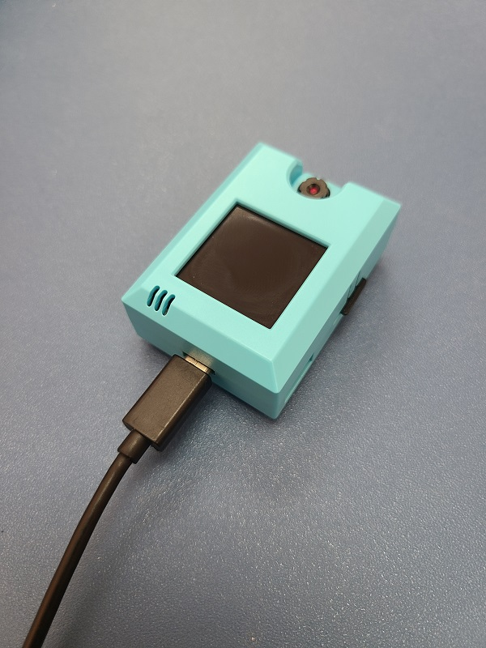
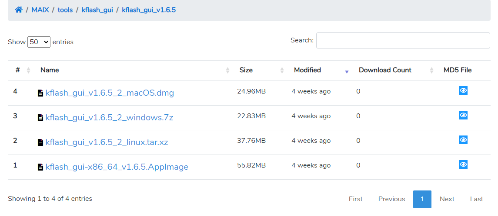
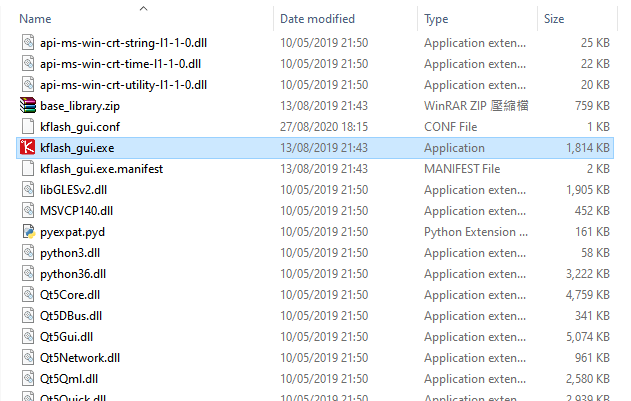
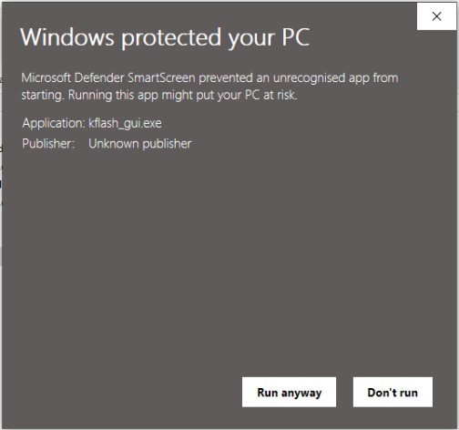
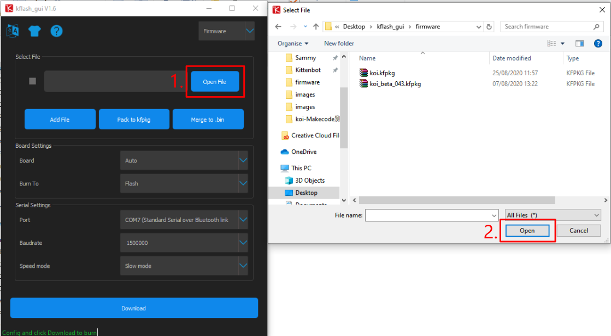
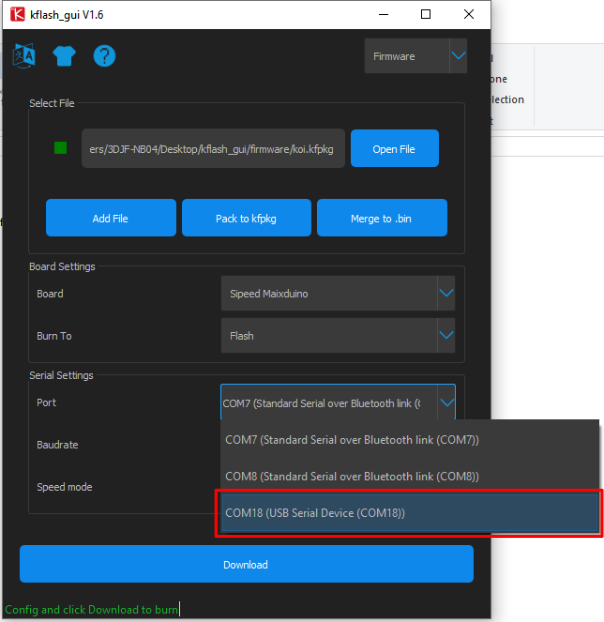
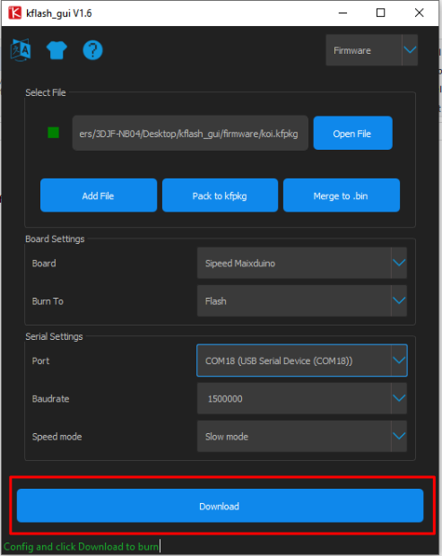
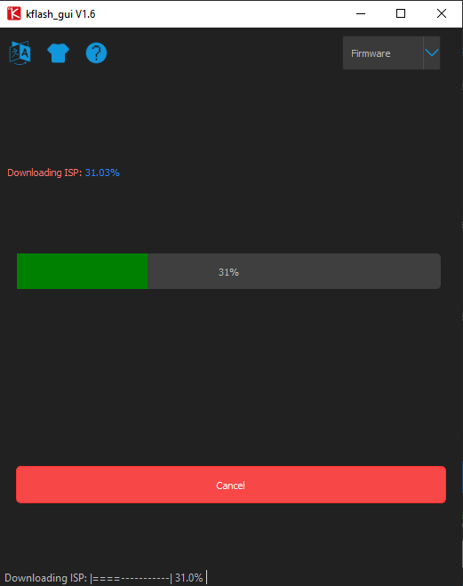

# **KOI固件更新教學**

開發團隊會不定時為KOI推出更新固件，以改進KOI AI鏡頭的功能。

用家可到這裏查看最新的固件版本, 以下為更新KOI 固件的方法。

(建議在更新固件前, 前先把現版本的固件也保存下來, 若在更新固件後遇到不良情況, 可回復到前一版本的固件)

## **重刷固件方法**

將KOI插入電腦的USB接口。

更新固件需要預備2樣檔案，**刷件程式**和**固件檔案**, 點擊以下連結下截。

[下載刷件程式](https://dl.sipeed.com/MAIX/tools/kflash_gui/kflash_gui_v1.6.5)

[固件檔案下載](./updateHist.md)

**1. 按照電腦的作業系統下載刷件程式。**

**2. 將檔案解壓縮。**

**3. 打開kflash_gui.exe。**

**4. 請允許運行。**

**5. 打開固件檔案。**

**6. 在Board選擇Sipeed Maixduino。**

**7. 在Port選擇連接KOI的接口。**

**8. 其他設定可以使用預設值，按下載。**

**9. 耐心等待下載完成。**

**10. 下載完成！**

**11. 然後按Reset重啟KOI。**

