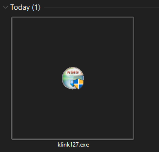
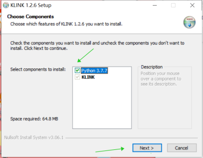
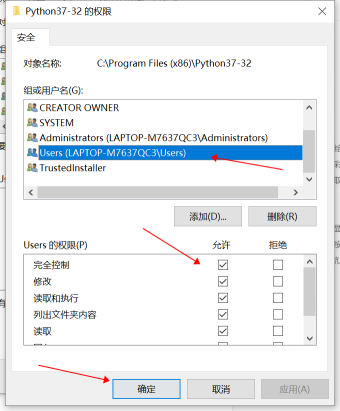

# KLink安裝

KLink是下載Kittenbot軟件的介面，方便大家一鍵下載和更新Kittenbot的軟件。您可以在KLink啟動KittenCode或Kittenblock。

## KLINK下載

### 下載地址

Windows 10系統：

[KLink下載地址](http://bit.ly/klinkDownload)

MacOS系統：

[KLink下載地址](http://bit.ly/klinkDownloadforMac)

### 雙擊安裝

下載後雙擊圖示安裝。

Windows 10系統：

    注意，需要剔選安裝Python3.7.7。

MacOS用戶：

    根據下圖的指示，按順序安裝。

## 疑難排解

### Windows可能會遇到權限問題，請按照下圖修復。

1. 前往C:\Program Files (x86)\Python37-32
2. 右鍵->屬性->安全->編輯
3. 點選用戶，剔選完全控制然後按確認

