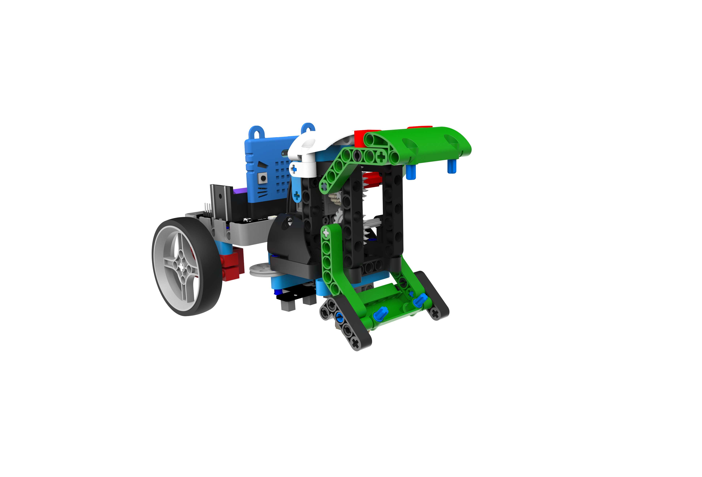
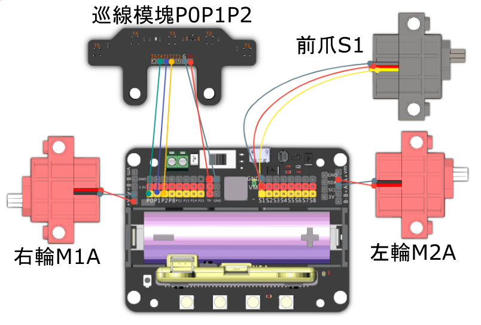

# 路障剋星

利用機械人的大夾子，將大型的障礙物搬到戰場上阻擋敵方前進，或者負責清除路障。

## 組裝說明書和參考程式

說明書資源包： [資源包下載地址](https://bit.ly/12In1SumobotBuildingInstruction)

參考程式: 

[路障剋星-JoyFrog搖控](https://makecode.microbit.org/_FDF4x99xf8UH)

[路障剋星-microbit搖控](https://makecode.microbit.org/_gwoa09KhTd1q)

[路障剋星-主體](https://makecode.microbit.org/_MKqcWU0y6WHC)

## 參考接線

## 模型玩法

### JoyFrog遊戲手柄:

1. 將模型打開之後，手掣上的Microbit會顯示心形圖案然後顯示0號，機械人會顯示0號。
2. 利用手掣上的搖桿控制機械人的移動，按下A鍵收起大爪，B鍵放開大爪。
3. 按下X鍵切換至巡線模式。

### Microbit控制:

1. 將模型打開之後，手掣上的Microbit會顯示心形圖案然後顯示0號，機械人會顯示0號。
2. 利用Microbit的陀螺儀控制機械人的移動，按下B鍵收起大爪和放開大爪。
3. 按下A鍵切換至巡線模式。