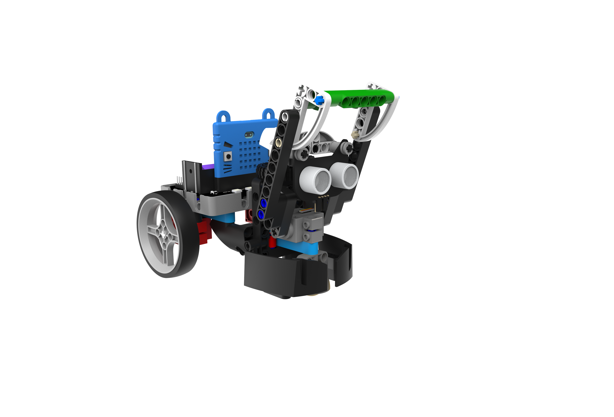
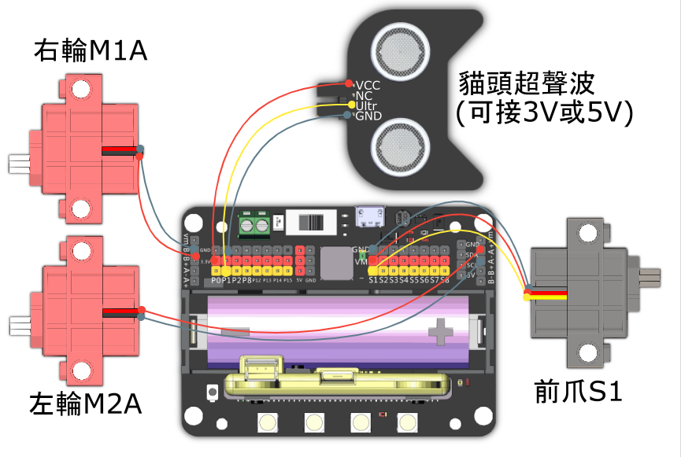

# 機靈捕手

利用機械人的擋板，保護戰場上的物資。它亦可以自動避開障礙，以免被對手搶奪手上的物資。

## 組裝說明書

說明書資源包： [資源包下載地址](https://bit.ly/Powerbrick10in1BuildingGuide)

## 參考接線

## 模型玩法

### JoyFrog遊戲手柄:

1. 將模型打開之後，手掣上的Microbit會顯示心形圖案符號。
2. 利用手掣上的搖桿控制機械人的移動，按下A鍵放下擋板，B鍵收起擋板。
3. 按下X鍵切換至避障模式，機械人遇到障礙物會轉換方向繼續前進，可以作為自動防禦機制。
4. 按下Y鍵，手掣的Microbit會顯示超聲波距離。

### Microbit控制:

1. 將模型打開之後，手掣上的Microbit會顯示心形圖案符號。
2. 利用手掣上的搖桿控制機械人的移動，按下A鍵放下擋板，再按一下收起擋板。
3. 按下B鍵切換至避障模式，機械人遇到障礙物會轉換方向繼續前進，可以作為自動防禦機制。
4. 同時按下A和B鍵，Microbit會顯示超聲波距離。