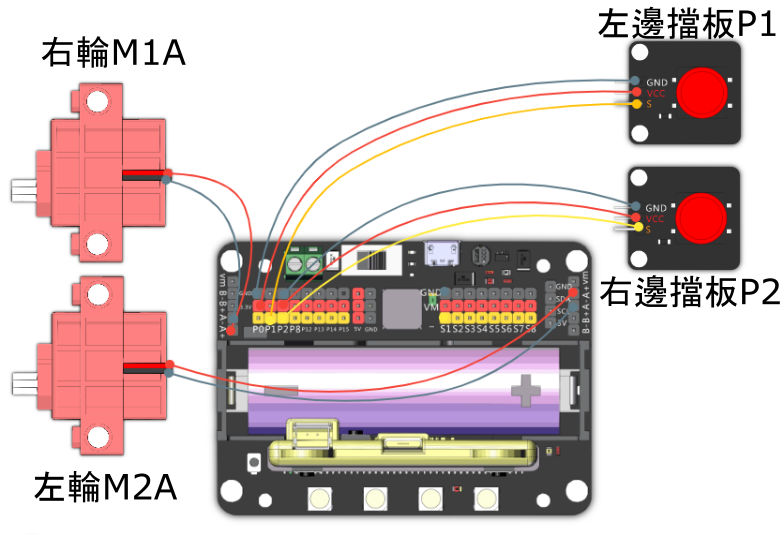

# 狂暴角龍

透過用角撞擊對手進行攻擊，令對手損失血量。

## 組裝說明書和參考程式

說明書資源包： [資源包下載地址](https://bit.ly/12In1SumobotBuildingInstruction)

參考程式: 

[狂暴角龍-joyfrog搖控](https://makecode.microbit.org/_dhce3PKms5Fk)

[狂暴角龍-microbit搖控](https://makecode.microbit.org/_J8w7WriE9D4D)

[狂暴角龍-主體](https://makecode.microbit.org/_2ixfyk1TAHEh)

## 參考接線

## 模型玩法

### JoyFrog遊戲手柄:

1. 將模型打開之後，手掣上的Microbit會顯示X符號，機械人會亮著紅燈。
2. 按下手掣的A按鍵，與機械人配對。當機械人亮起綠燈和Microbit出現生命值就可以開始行動。
3. 利用手掣上的搖桿控制機械人的移動，攻擊或閃避敵人。
4. 機械人左右裝甲被擊中之後，生命值會扣減1。Microbit上會更新生命值，機械人上的血條亦會扣減。
5. 生命值減至0之後，Microbit上出現黑臉圖案，機械人出現X符號，代表已經落敗。

### Microbit控制:

1. 將模型打開之後，手掣上的Microbit會顯示X符號，機械人會亮著紅燈。
2. 按下Microbit的A按鍵，與機械人配對。當機械人亮起綠燈和Microbit出現生命值就可以開始行動。
3. 利用Microbit的陀螺儀控制機械人的移動，攻擊或閃避敵人。
4. 機械人左右裝甲被擊中之後，生命值會扣減1。Microbit上會更新生命值，機械人上的血條亦會扣減。
5. 生命值減至0之後，Microbit上出現黑臉圖案，機械人出現X符號，代表已經落敗。

