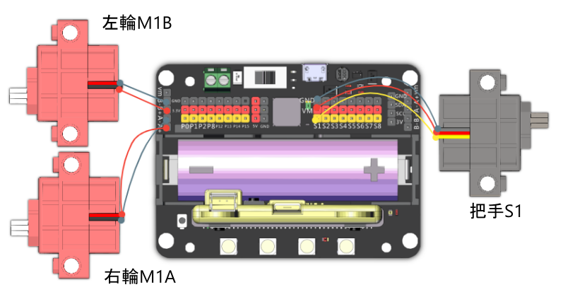

# 奪旗校尉

利用車子上的把手，嘗試將對手左右兩旁的旗幟巧妙地奪下來。

## 組裝說明書和參考程式

說明書和參考程式資源包： [資源包下載地址](https://bit.ly/Powerbrick10in1BuildingGuide)

## 參考接線

## 模型玩法

### JoyFrog遊戲手柄:

1. 將模型打開之後，手掣上的Microbit會顯示X符號，機械人會亮著紅燈。
2. 按下手掣的X按鍵，與機械人配對。當機械人亮起綠燈和Microbit出現剔號就可以開始行動。
3. 利用手掣上的搖桿控制機械人的移動，按下A鍵向左攻擊，B鍵向右攻擊。

### Microbit控制:

1. 將模型打開之後，Microbit會顯示X符號，機械人會亮著紅燈。
2. 按下Microbit的A和B按鍵，與機械人配對。當機械人亮起綠燈和Microbit出現剔號就可以開始行動。
3. 利用Microbit的陀螺儀控制機械人的移動，按下A鍵向左攻擊，B鍵向右攻擊。