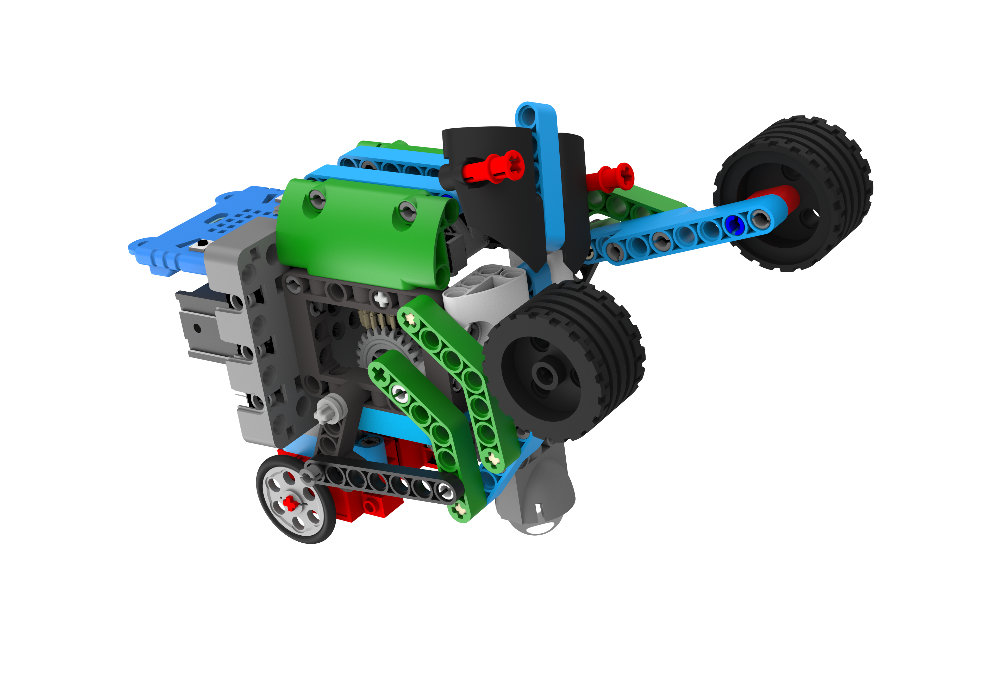
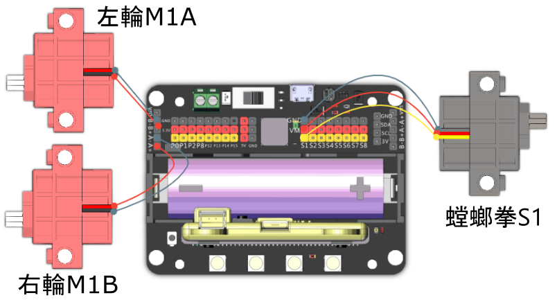

# 巨拳螳螂

利用機械人的螳螂拳，將對手打倒。

## 組裝說明書

說明書資源包： [資源包下載地址](https://bit.ly/Powerbrick10in1BuildingGuide)

## 參考接線

## 模型玩法

### JoyFrog遊戲手柄:

1. 將模型打開之後，手掣上的Microbit會顯示X符號，機械人會亮著紅燈。
2. 按下手掣的A按鍵，與機械人配對。當機械人亮起綠燈和Microbit出現剔號就可以開始行動。
3. 利用手掣上的搖桿控制機械人的移動，按下B鍵進行攻擊。

### Microbit控制:

1. 將模型打開之後，Microbit會顯示X符號，機械人會亮著紅燈。
2. 按下Microbit的A，與機械人配對。當機械人亮起綠燈和Microbit出現剔號就可以開始行動。
3. 利用Microbit的陀螺儀控制機械人的移動，按下B鍵進行攻擊。