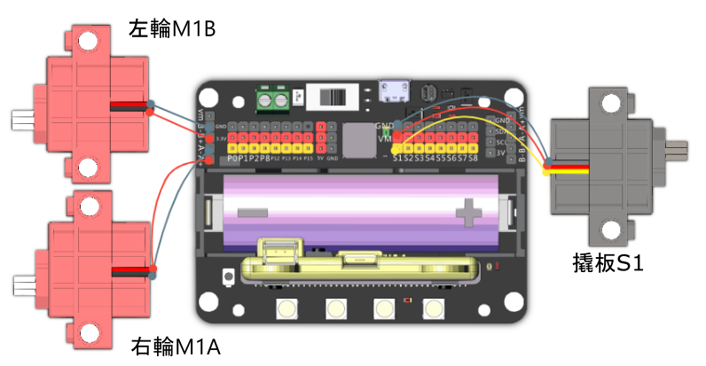

# 相撲小子

用車子進行比拼，您可以攻擊對手，嘗試令它倒下；或者進入防禦勢態，抵擋對方攻擊。你亦可以利用你強壯的身軀，將對手推出格鬥場。

## 組裝說明書和參考程式

說明書資源包： [資源包下載地址](https://bit.ly/12In1SumobotBuildingInstruction)

參考程式: 

[相撲小子-JoyFrog搖控](https://makecode.microbit.org/_DEmiTaf1qAz2)

[相撲小子-microbit搖控](https://makecode.microbit.org/_a3FgJm1dXRka)

[相撲小子-主體](https://makecode.microbit.org/_FYAD3f49c54q)

## 參考接線

## 模型玩法

### JoyFrog遊戲手柄:

1. 將模型打開之後，手掣上的Microbit會顯示X符號，機械人會亮著紅燈。
2. 按下手掣的X按鍵，與機械人配對。當機械人亮起綠燈和Microbit出現剔號就可以開始行動。
3. 利用手掣上的搖桿控制機械人的移動，按下A鍵進行攻擊，B鍵進行防禦。

### Microbit控制:

1. 將模型打開之後，Microbit會顯示X符號，機械人會亮著紅燈。
2. 按下Microbit的A和B按鍵，與機械人配對。當機械人亮起綠燈和Microbit出現剔號就可以開始行動。
3. 利用Microbit的陀螺儀控制機械人的移動，按下A鍵進行攻擊，B鍵進行防禦。