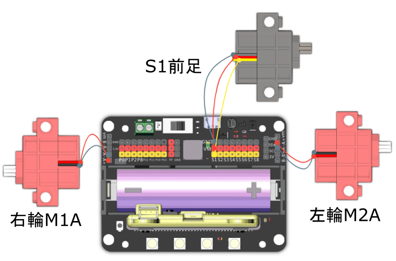

# 足球小將

在模擬的足球場上，利用它敏捷的身手將足球帶到龍門前面射球。

## 組裝說明書和參考程式

說明書資源包： [資源包下載地址](https://bit.ly/Powerbrick10in1BuildingGuide)

[參考程式: 足球小將-joyfrog搖控](https://makecode.microbit.org/_ca7VFifeAhj4)

[參考程式: 足球小將-microbit搖控](https://makecode.microbit.org/_V2da9FUy6eXy)

[參考程式: 足球小將-主體](https://makecode.microbit.org/_V99A0ic03X50)

## 參考接線

## 模型玩法

### JoyFrog遊戲手柄:

1. 將模型打開之後，手掣上的Microbit會顯示X符號，機械人會亮著紅燈。
2. 按下手掣的A按鍵，與機械人配對。當機械人亮起綠燈和Microbit出現剔號就可以開始行動。
3. 利用手掣上的搖桿控制機械人的移動。
4. 時機適當時，按下B鍵，將足球踢出。

### Microbit控制:

1. 將模型打開之後，Microbit會顯示X符號，機械人會亮著紅燈。
2. 按下Microbit的A按鍵，與機械人配對。當機械人亮起綠燈和Microbit出現剔號就可以開始行動。
3. 利用Microbit的陀螺儀控制機械人的移動。