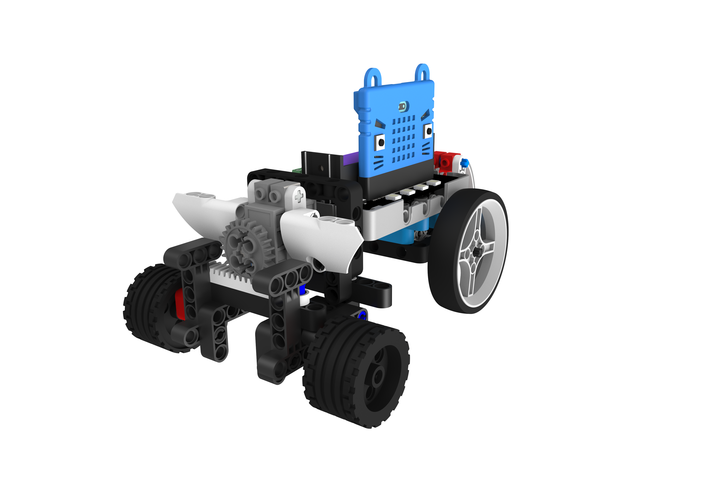
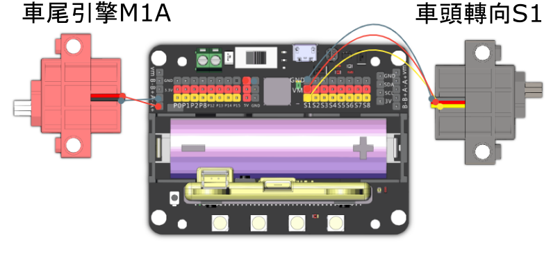

# 風馳電掣

這是一台為競速而誕生的車子，利用它的速度和你的技術，與其他車手在賽道上較量。

## 組裝說明書和參考程式

說明書資源包： [資源包下載地址](https://bit.ly/12In1SumobotBuildingInstruction)

參考程式: 

[風馳電掣-joyfrog搖控](https://makecode.microbit.org/_H0udau4FrYqW)

[風馳電掣-microbit搖控](https://makecode.microbit.org/_XcR2kH8iqMmY)

[風馳電掣-主體](https://makecode.microbit.org/_WjWYEHPJJW4c)

## 參考接線

## 模型玩法

### JoyFrog遊戲手柄:

1. 將模型打開之後，手掣上的Microbit會顯示X符號，車子會亮著紅燈。
2. 按下手掣的A按鍵，與車子配對。當車子亮起綠燈和Microbit出現剔號就可以開始行動。
3. 利用手掣上的搖桿控制車子的移動。

### Microbit控制:

1. 將模型打開之後，Microbit會顯示X符號，車子會亮著紅燈。
2. 按下Microbit的A和B按鍵，與車子配對。當車子亮起綠燈和Microbit出現剔號就可以開始行動。
3. 利用Microbit的陀螺儀控制車子的移動，按下A鍵將車子停下來，B鍵鎖定轉向。