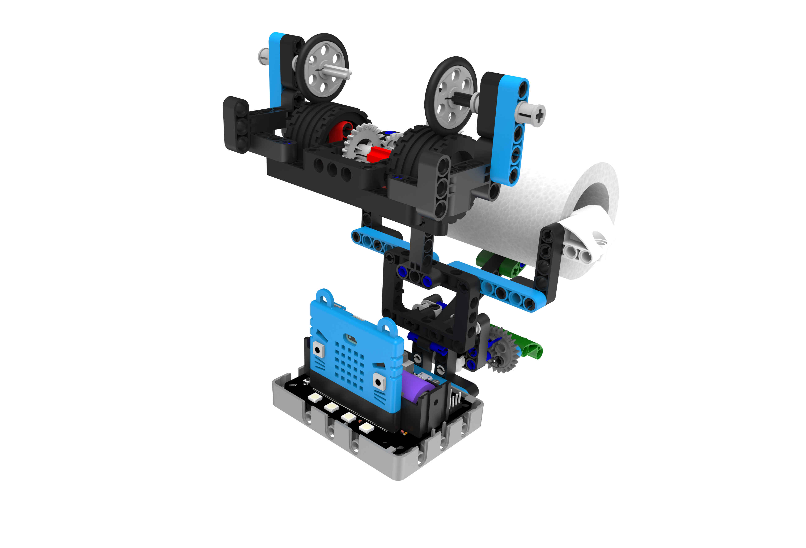
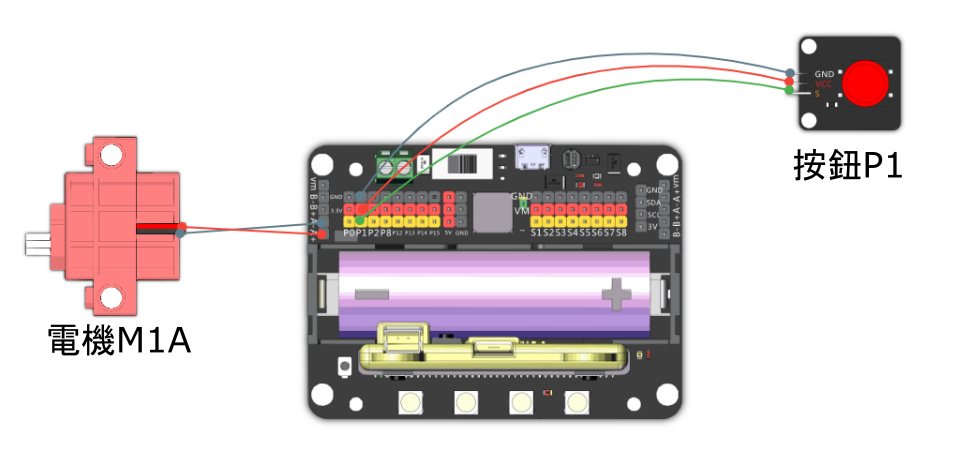

# 智能紙巾機

能夠自動出紙的智能紙巾機。

## 組裝說明書和參考程式

說明書資源包： [資源包下載地址](https://bit.ly/12In1SumobotBuildingInstruction)

參考程式: 

[智能紙巾機-主體](https://makecode.microbit.org/_EFYdx3ektJcx)

## 參考接線

## 模型玩法

1. 首先裝上一卷紙巾。
2. 按下板手出紙，放開板手停止出紙。