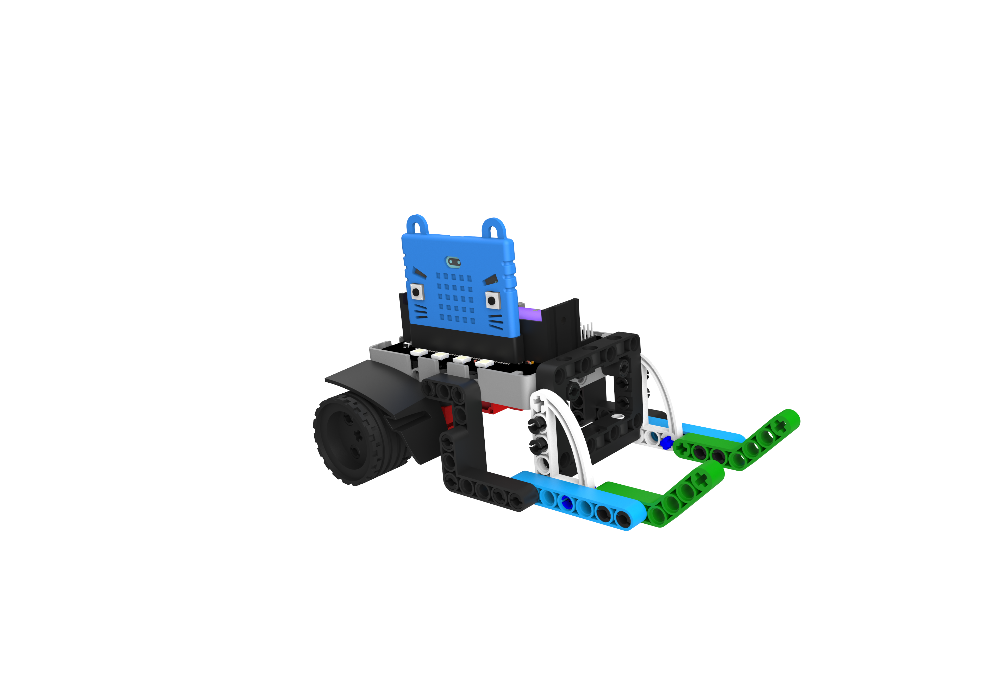
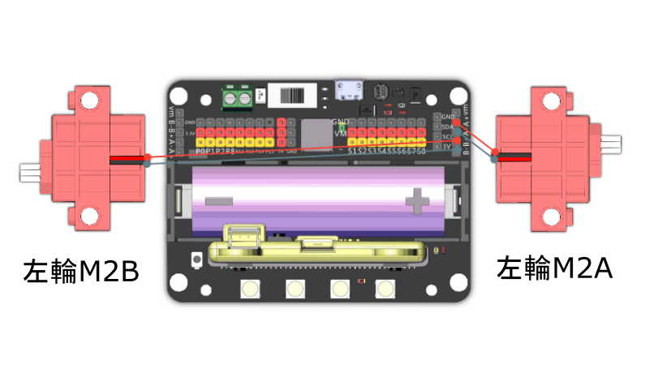

# 瘋狂掠奪者

利用它敏捷的身手，嘗試將戰場上的物資搶先帶回基地，防止對方得逞。

## 組裝說明書和參考程式

說明書資源包： [資源包下載地址](https://bit.ly/Powerbrick10in1BuildingGuide)

[參考程式: 瘋狂掠奪者-JoyFrog搖控](https://makecode.microbit.org/_bMTCUsX7TgeX)

[參考程式: 瘋狂掠奪者-microbit搖控](https://makecode.microbit.org/_cMpDja8ie5Cx)

[參考程式: 瘋狂掠奪者-主體](https://makecode.microbit.org/_RuWcxCRk6CmJ)

## 參考接線

## 模型玩法

### JoyFrog遊戲手柄:

1. 將模型打開之後，手掣上的Microbit會顯示X符號，機械人會亮著紅燈。
2. 按下手掣的X按鍵，與機械人配對。當機械人亮起綠燈和Microbit出現剔號就可以開始行動。
3. 利用手掣上的搖桿控制機械人的移動。

### Microbit控制:

1. 將模型打開之後，Microbit會顯示X符號，機械人會亮著紅燈。
2. 按下Microbit的A和B按鍵，與機械人配對。當機械人亮起綠燈和Microbit出現剔號就可以開始行動。
3. 利用Microbit的陀螺儀控制機械人的移動。