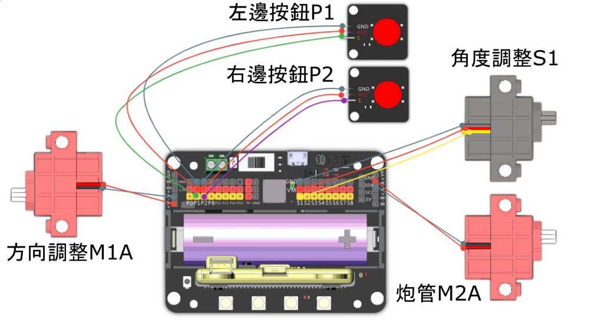

# 戰爭炮台

遠距離攻擊型機械人，您可以控制炮台的角度的方向，瞄準之後發射橡筋。

## 組裝說明書和參考程式

說明書資源包： [資源包下載地址](https://bit.ly/12In1SumobotBuildingInstruction)

參考程式: 

[戰爭炮台-主體](https://makecode.microbit.org/_1HuUtRi7rbat)

## 參考接線

## 模型玩法

1. 在炮台頂部齒輪上裝好橡筋，然後將模型打開。
2. 按下左邊的按鈕調整炮台發射角度。
3. 按下Microbit的A和B鍵調教炮台方向。
4. 瞄準之後按右邊按鈕，將橡筋發射。