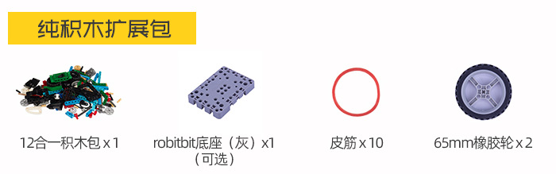
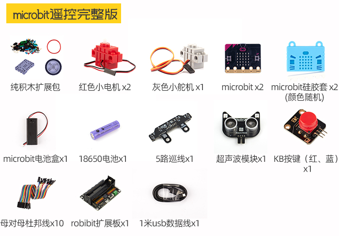
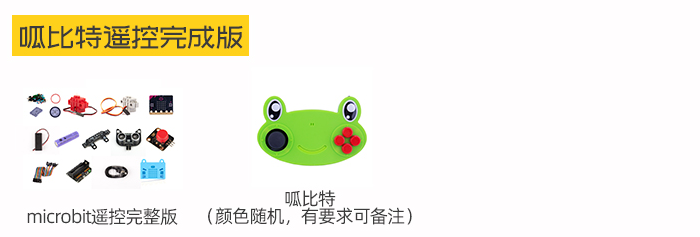

# SumoBot 12合1套件

SumoBot 12合1套件是一套針對Microbit而設計的擴充套件，它是一套競技性的遊樂套件。

透過組裝不同的模型和針對模型進行編程然後與人比拼，用家可以在刺激的競技遊戲之中學會動手搭建和邏輯編程，培養玩家對編程和工程的興趣。

## 套件內容

 

## 套件特色

- 將學習融合在遊戲之中

- 擴展板支援樂高積木，容許自行擴展

- 容易上手的編程

- 小孩子也能搭建的模型

- 配合大家手上已經有的Microbit使用

- 支援Kittenbot其他產品

## 介紹短片

