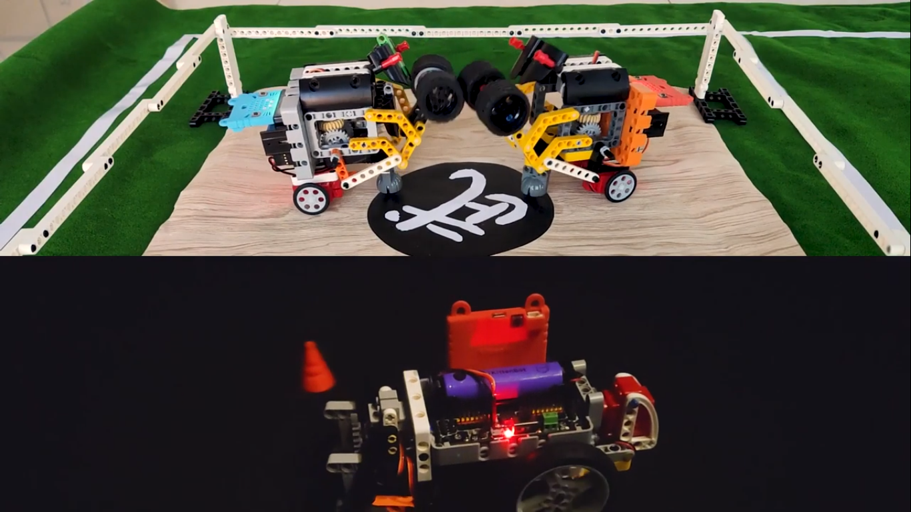
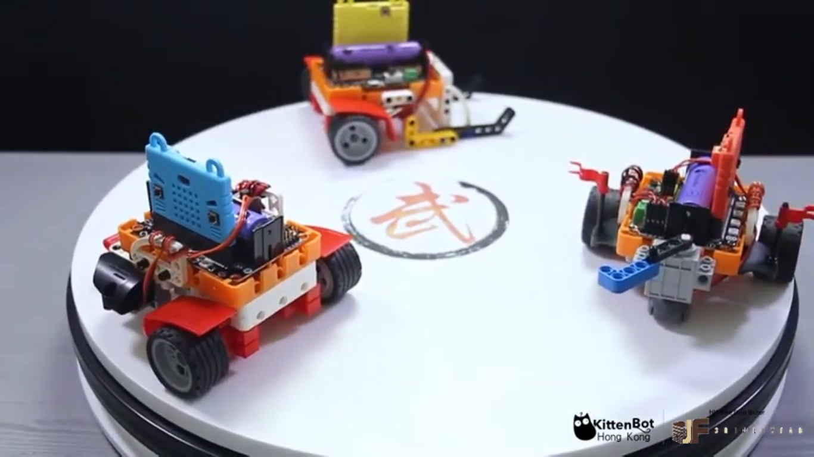
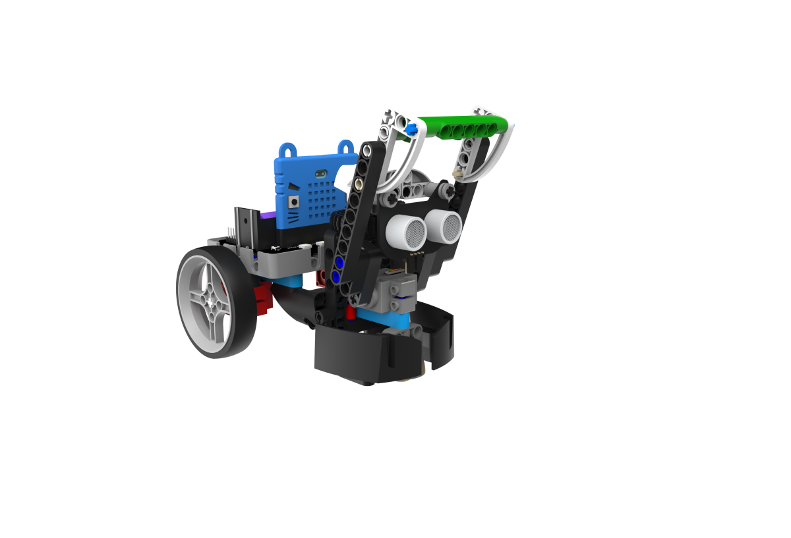
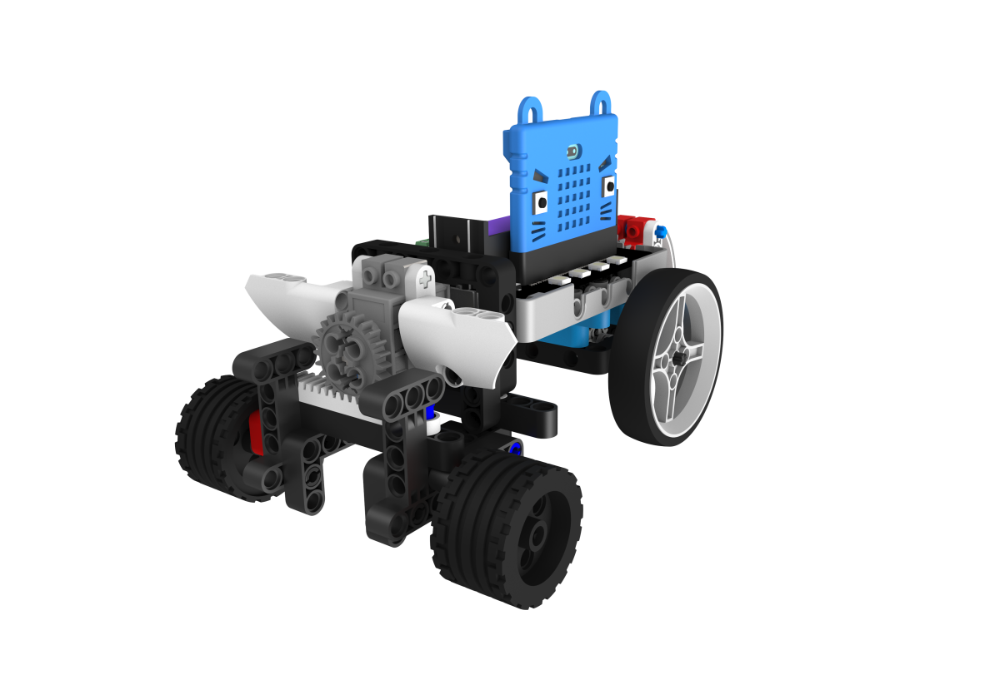

# MR STEMer 12合1套件

MR STEMer 12合1套件是一套針對Microbit而設計的擴充套件，它是一套競技性的遊樂套件。

透過組裝不同的模型和針對模型進行編程然後與人比拼，用家可以在刺激的競技遊戲之中學會動手搭建和邏輯編程，培養玩家對編程和工程的興趣。

## 套件內容

## 套件特色

- 將學習融合在遊戲之中

- 擴展板支援樂高積木，容許自行擴展

- 容易上手的編程

- 小孩子也能搭建的模型

- 配合大家手上已經有的Microbit使用

- 支援Kittenbot其他產品

## 產品參數：

請參考[Robotbit介紹]()。

## 介紹短片

## 模型玩法

### 1. 雷暴犀牛

利用車子上的硬角進行比拼，您用角可以攻擊對手，嘗試令它倒下；或者進入防禦勢態，抵擋對方攻擊。你亦可以利用你堅硬的角，將對手推出格鬥場。

### 2. 奪旗校尉

利用車子上的擺手，嘗試將對手左右兩旁的旗幟巧妙地奪下來。

### 3. 瘋狂掠奪者

利用它敏捷的身手，嘗試將戰場上的物資搶先帶回基地，防止對方得逞。

### 4. 巨拳螳螂

利用機械人的螳螂拳，將對手打倒。

### 5. 機靈捕手

### 6. 狂暴角龍

### 7. 相撲選手

### 8. 足球小將

### 9. 路障剋星

### 10. 風馳電掣

這是一台為競速而誕生的車子，利用它的速度和你的技術，與其他車手在賽道上較量。

### 11. 戰爭炮台

### 12. 智能紙巾機