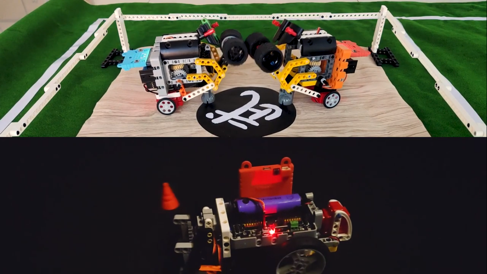

# MR STEMER 3合1格鬥小車套件

MR STEMER 3合1格鬥小車套件(HKBK8017A)

MR STEMER 3合1格鬥小車套件是一套針對Microbit而設計的一套競技性遊樂擴充套件。

透過組裝不同的模型和針對模型進行編程然後與人比拼，用家可以在刺激的競技遊戲之中學會動手搭建和邏輯編程，培養玩家對編程和工程的興趣。

## 套件內容

1. Robotbit擴展板x1(只限標準版)
2. 18650鋰電池x1(只限標準版)
3. 積木包x1
4. 65mm 車輪x2
5. GeekServo電機x2
6. GeekServo舵機x1
7. 按鍵模塊x2
8. 貓頭超聲波模塊x1
9. 五路巡線模塊x1
10. JoyFrog手掣x1
11. Microbit電池盒x1
12. Microbit矽膠套x1
13. 母對母杜邦線x1排
14. USB線x1

## 套件特色

- 將學習融合在遊戲之中

- 擴展板支援樂高積木，容許自行擴展

- 容易上手的編程

- 小孩子也能輕易搭建的模型

- 配合大家手上已經有的Microbit使用

- 支援Kittenbot其他產品

## 產品參數：

請參考[Robotbit介紹](../../Microbit_eboard/Robotbitfull.md)。

## 介紹短片

## 模型玩法

### 1. 雷暴犀牛

利用車子上的硬角進行比拼，您用角可以攻擊對手，嘗試令它倒下；或者進入防禦勢態，抵擋對方攻擊。你亦可以利用你堅硬的角，將對手推出格鬥場。

### 2. 奪旗校尉

利用車子上的擺手，嘗試將對手左右兩旁的旗幟巧妙地奪下來。

### 3. 瘋狂掠奪者

利用它敏捷的身手，嘗試將戰場上的物資搶先帶回基地，防止對方得逞。

