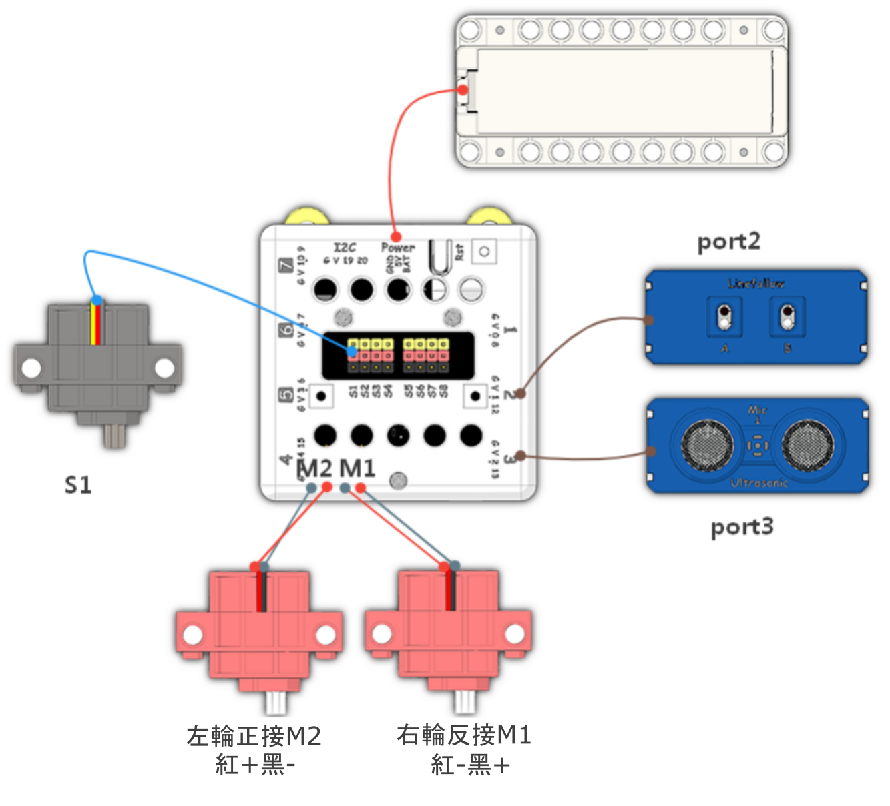

# 巡線清潔車說明書

## 教材資源包下載

包括說明書和音效檔案： [資源包下載地址](https://bit.ly/Powerbrick10in1BuildingGuide)

## 參考接線

## 參考程式

[參考程式資源包下載地址](https://bit.ly/Powerbrick10in1ModelsHex)

## 模型玩法

這是一部自動的巡線清潔車。

首先在桌面用黑色膠紙貼出一條路線，然後將清潔車放到線上，將巡線感應器對準黑線，並開動模型。

按下按鍵A，清潔車就會自動沿著黑線前進，將沿途的物件掃走。
