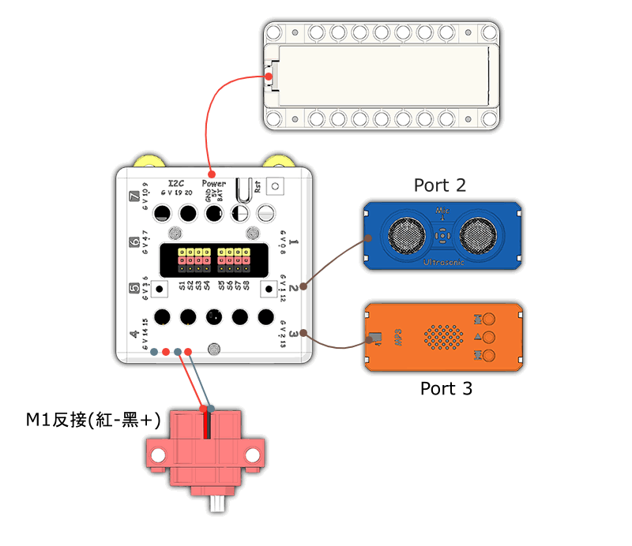

# 恐龍王說明書

## 教材資源包下載

包括說明書和音效檔案： [資源包下載地址](https://bit.ly/Powerbrick10in1BuildingGuide)

## 參考接線

## 參考程式

[參考程式資源包下載地址](https://bit.ly/Powerbrick10in1ModelsHex)

請將MP3檔案儲存到microSD卡，並將卡插入MP3模組。

## 模型玩法

這是一隻會行走的恐龍。

開動模型，然後按下A按鍵，恐龍會向前行走6秒然後停下來。

將手指放到超聲波感應器前5cm內，恐龍會發出吼聲。
