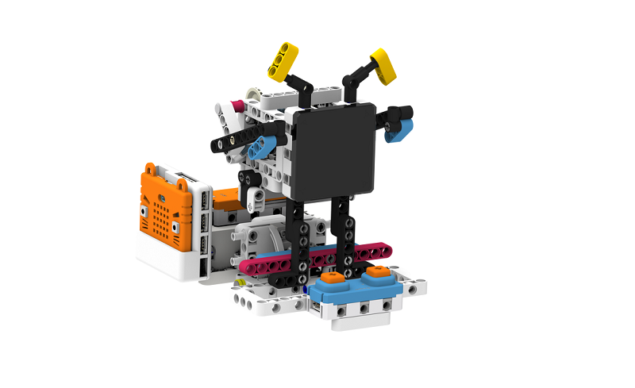
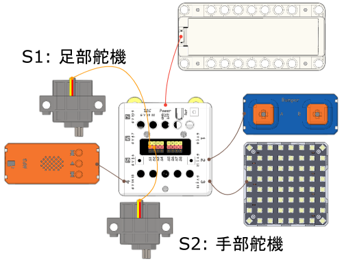

# 搖擺機械人說明書

## 教材資源包下載

包括說明書和音效檔案： [資源包下載地址](https://bit.ly/Powerbrick10in1BuildingGuide)

## 參考接線

## 參考程式

[參考程式資源包下載地址](https://bit.ly/Powerbrick10in1ModelsHex)

請將MP3檔案儲存到microSD卡，並將卡插入MP3模組。

    "Flying Kerfuffle" Kevin MacLeod (incompetech.com)
    Licensed under Creative Commons: By Attribution 4.0 License
    http://creativecommons.org/licenses/by/4.0/

## 模型玩法

這是一隻會跳舞的機械人。

開動模型後，按下MicroBit的A按鍵，模型會開始播放音樂，機械人會開始跳舞。

你亦可以按按鍵模組的A和B按鍵可以分別加長或減短機械人跳舞的時間。
