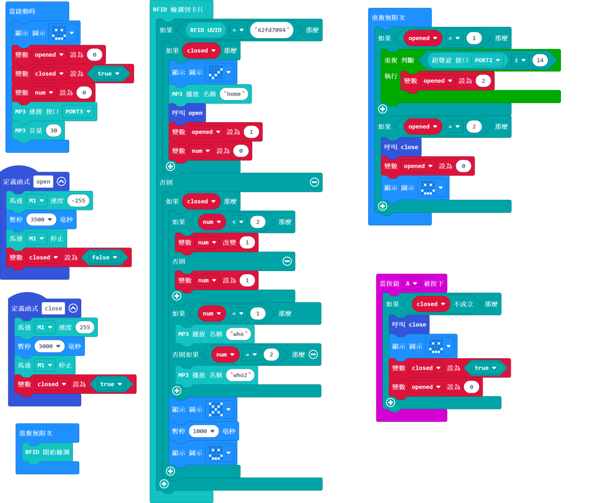

# 智能拍卡大閘說明書

## 教材資源包下載

包括說明書和音效檔案： [資源包下載地址](https://bit.ly/Powerbrick10in1BuildingGuide)

## 參考接線

## 參考程式

[參考程式資源包下載地址](https://bit.ly/Powerbrick10in1ModelsHex)

請將MP3檔案儲存到microSD卡，並將卡插入MP3模組。

    請將UUID改為自己套件中RFID的UUID。

## 模型玩法

這是一門智能的閘門。

將模型開動，然後將RFID卡拍在RFID感應器。

假如你拍的卡的UUID不對，大閘不會開啟並會作出警告；假如你拍的卡是正確，大門將會開啟並歡迎您，進門後大閘會自動關閉。

