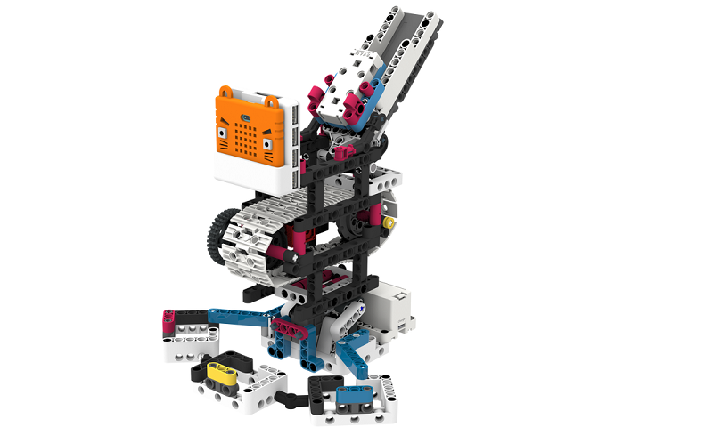
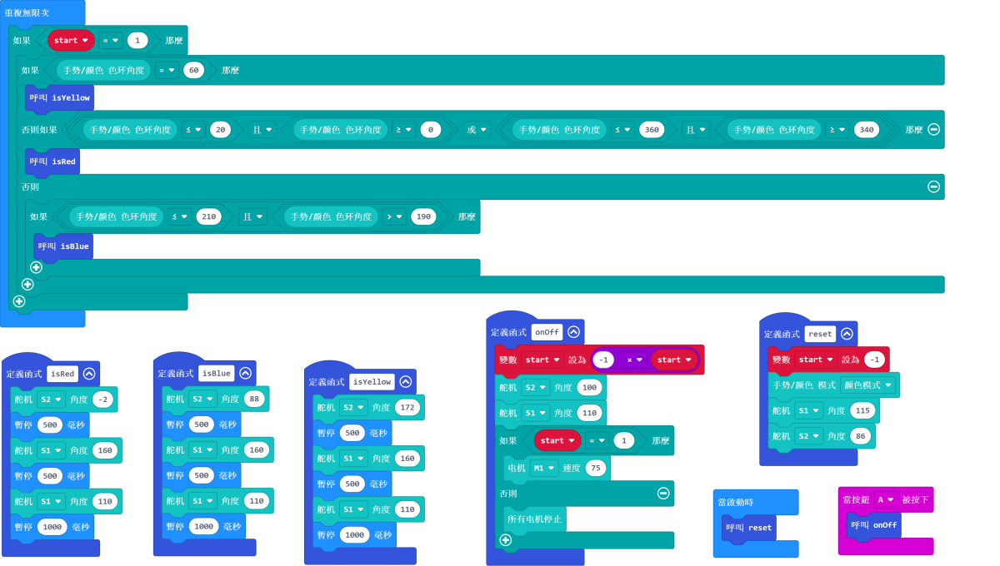

# 顏色分辨機說明書

## 教材資源包下載

包括說明書和音效檔案： [資源包下載地址](https://bit.ly/Powerbrick10in1BuildingGuide)

## 參考接線

## 參考程式

[參考程式資源包下載地址](https://bit.ly/Powerbrick10in1ModelsHex)

## 模型玩法

這是一部顏色分辨機，他可以分辨藍色、黃色和紅色的積木。

將模型開動，將藍色、黃色或紅色的積木放在模型背上的斜斗。

感應器會識別它的顏色，然後將積木輸送到相應的收集箱。
