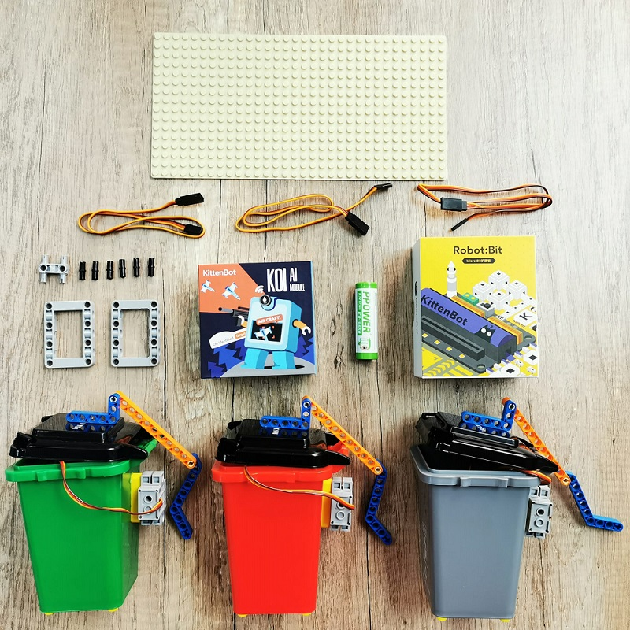
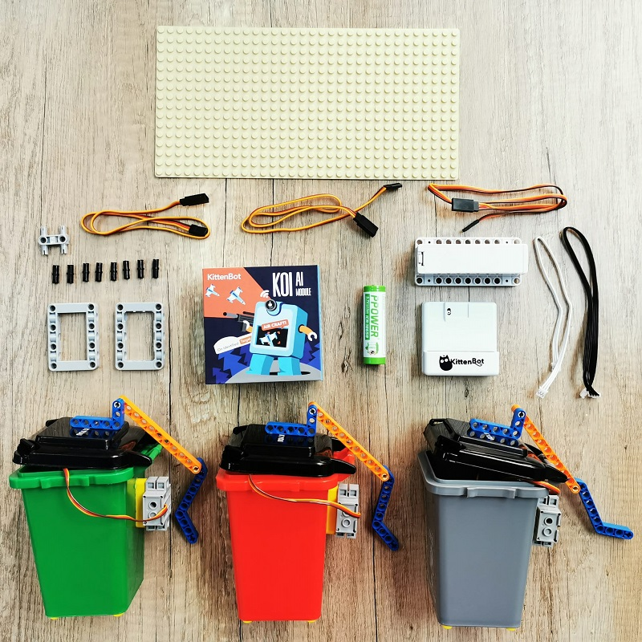
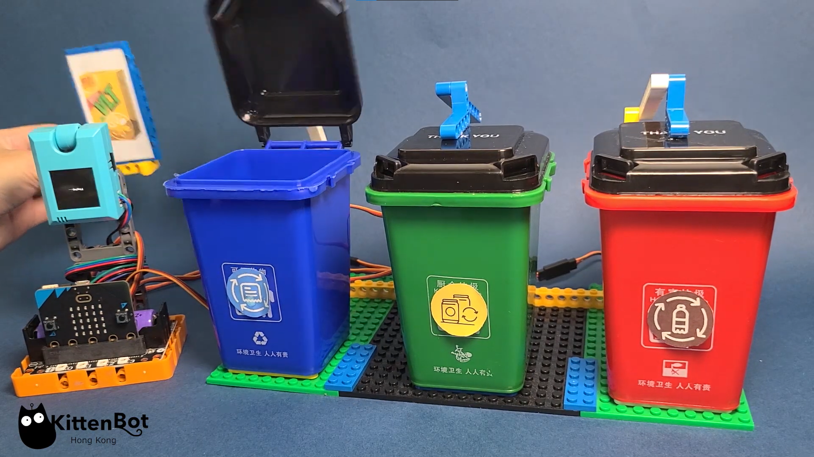

# AI/AIoT 智能回收箱套件

AI/AIoT智能回收箱是一套運用KOI的AI功能實現垃圾分類的套件。

## 套件特色

- 結合AI與環保課題，培養環保意識
- 可以配合IoT平台，輕易實現AIoT的應用
- 兼容樂高系列積木，方便搭建美觀的應用案例
- 支援MakeCode編程
- 提供輕巧的收納盒，方便課堂完成後收拾物資

## 套件內容

### 配搭Robotbit使用

### 配搭Armourbit使用

### 套件內容清單

- KOI AI鏡頭 連128MB SD卡 x1
- Armourbit+電池盒 / Robotbit Edu x1
- 18650鋰電池 x1
- GeekServo 9G灰色舵機 x3
- 舵機延長線 x3
- 塑膠玩具垃圾桶 x3
- 塑膠積木
- 積木底板

## 示範短片

