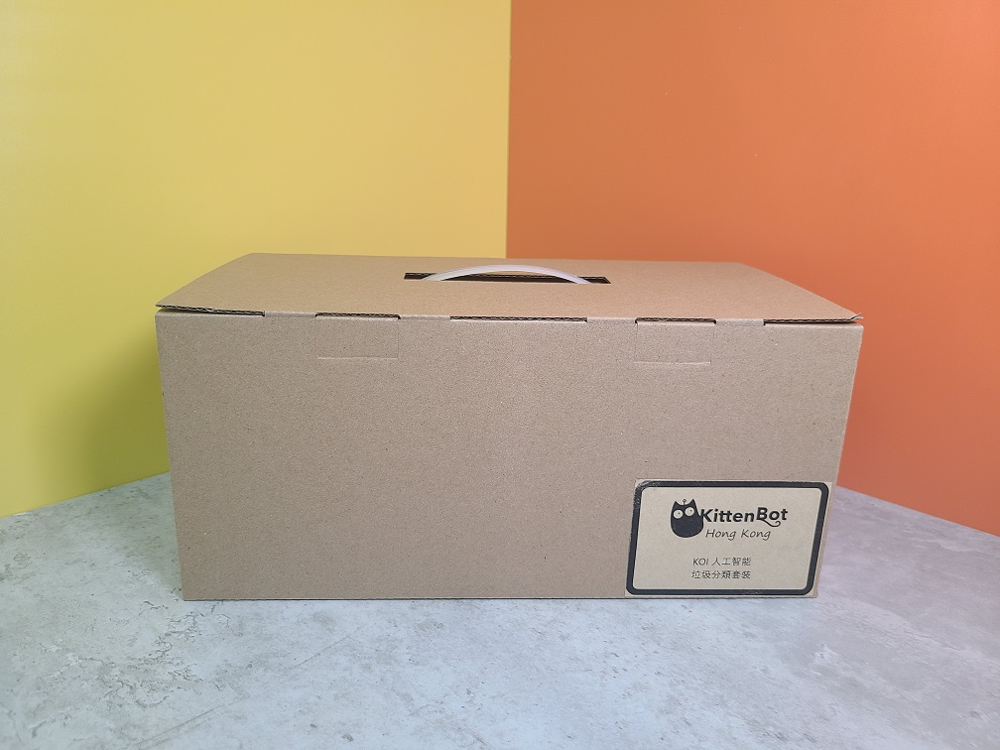

# AI/AIoT 智能回收箱套件

AI/AIoT智能回收箱是一套運用KOI的AI功能實現垃圾分類的套件。利用KOI的連線功能，搭配不同的物聯網平台，可以輕易地實踐AIoT的應用。

KittenBot希望透過此套件，培養學生對環保與保護地球的意識，在STEM的學習的同時亦能提升學生的人文素養。

## 套件特色

- 結合AI與環保課題，培養環保意識
- 可以配合IoT平台，輕易實現AIoT的應用
- 兼容樂高系列積木，方便搭建美觀的應用案例
- 支援MakeCode編程
- 提供輕巧的收納盒，方便課堂完成後收拾物資

## 套件規格

- 包裝尺寸：31cm x 17cm x 14 cm
- 支援主控板：Micro:bit，未來板

## 套件內容

### 配搭Robotbit使用

### 配搭Armourbit使用

### 套件內容清單

- KOI AI鏡頭 連128MB SD卡 x1
- Armourbit+電池盒 / Robotbit Edu x1
- 18650鋰電池 x1
- GeekServo 9G灰色舵機 x3
- 舵機延長線 x3
- 塑膠玩具垃圾桶 x3
- 塑膠積木
- 積木底板

## 套件包裝

每套AI/AIoT 智能回收箱套件都附有一個帶有手抽的收納盒。

## 示範短片

