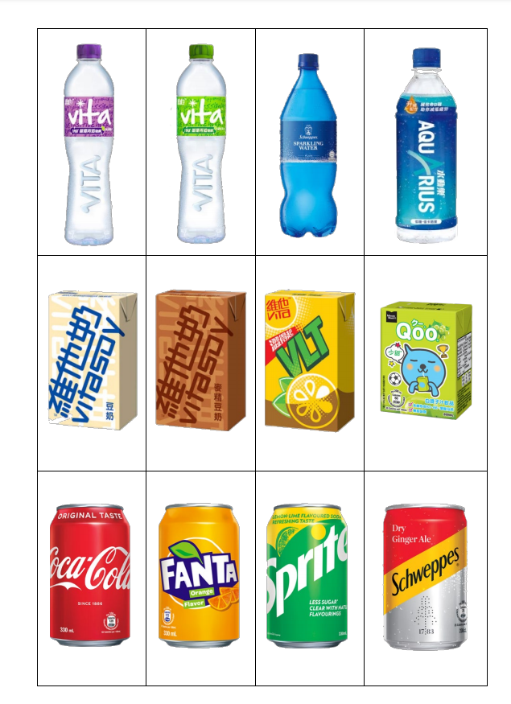
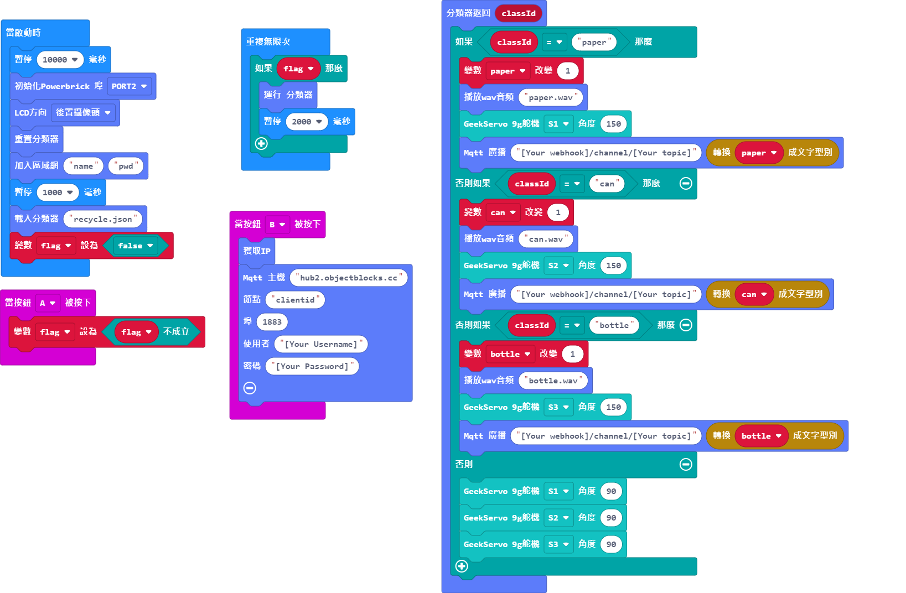

# AI/AIoT 智能回收箱套件教學

### 資源下載

[音效檔下載](https://drive.google.com/file/d/1GEJpytMGa4GYDSfpvDlvfwSC0fG-qENg/view?usp=sharing)

[參考圖檔下載](https://drive.google.com/drive/folders/1l27lVZQ-IEcx-_u2yh-VkV3N75coOGbE?usp=sharing)

## 模型訓練參考程式

[Armourbit版參考程式](https://makecode.microbit.org/_JrW0YiUai2r8)

[Robotbit版參考程式](https://makecode.microbit.org/_Ew7AEaDzw78e)

### 訓練方法

1. Micro:bit會顯示目前的分類。
1. 按A對現時分類進行訓練。
2. 按B跳到下一個分類。
3. 按A+B儲存模型。

## AI智能回收箱參考程式

[Armourbit版參考程式](https://makecode.microbit.org/_EErK8LD3U4zr)

[Robotbit版參考程式](https://makecode.microbit.org/_3EFJLh3Tc7sL)

### 辨認方法

1. 按A啟動辨認功能。
2. KOI會說出辨認到的垃圾類別，然後打開相應的回收箱。

## AIoT智能回收箱參考程式

### MakerCloud平台版本

[Armourbit版參考程式](https://makecode.microbit.org/_2FLaVKhxbEWU)

[Robotbit版參考程式](https://makecode.microbit.org/_hER07TKE3Uiz)

### 辨認方法

1. 按A啟動辨認功能。
2. 按B確認KOI已成功連接網絡，並連接MakerCloud平台。
3. KOI會說出辨認到的垃圾類別，然後打開相應的回收箱。

### ObjectBlocks平台版本

[Armourbit版參考程式](https://makecode.microbit.org/_E28TWW0Fe46L)

[Robotbit版參考程式](https://makecode.microbit.org/_0YgJR1hf7T5J)

### 辨認方法

1. 按A啟動辨認功能。
2. 按B確認KOI已成功連接網絡，並連接ObjectBlocks平台。
3. KOI會說出辨認到的垃圾類別，然後打開相應的回收箱。