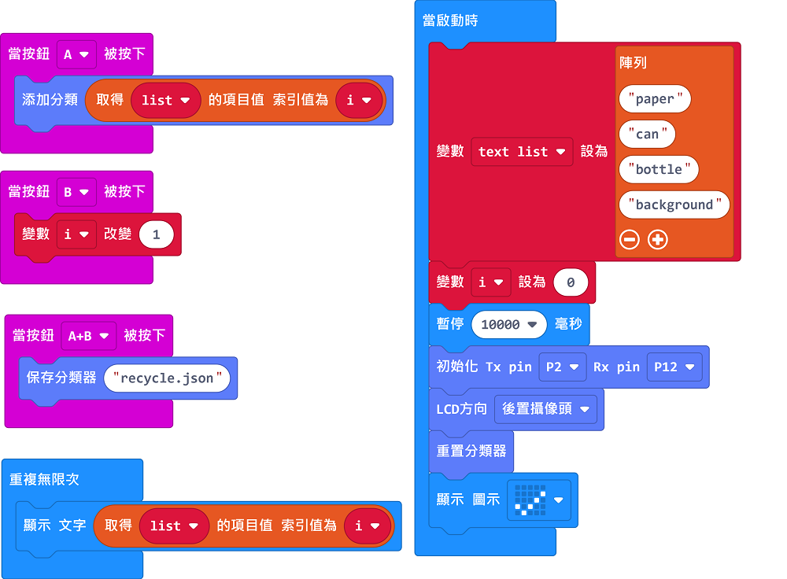
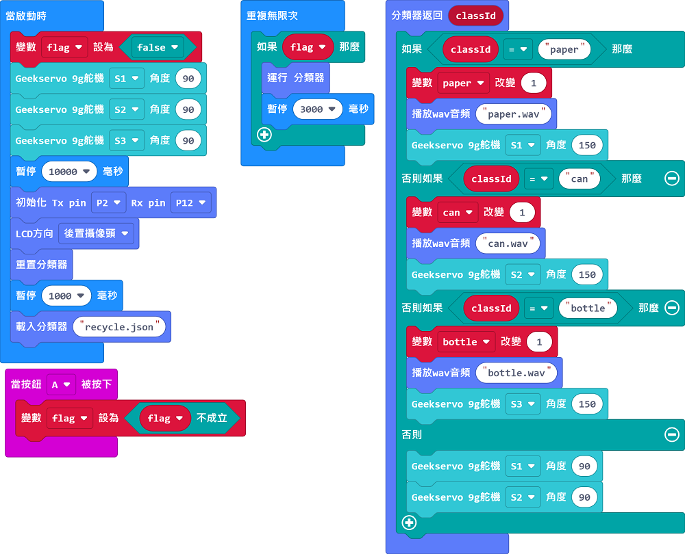
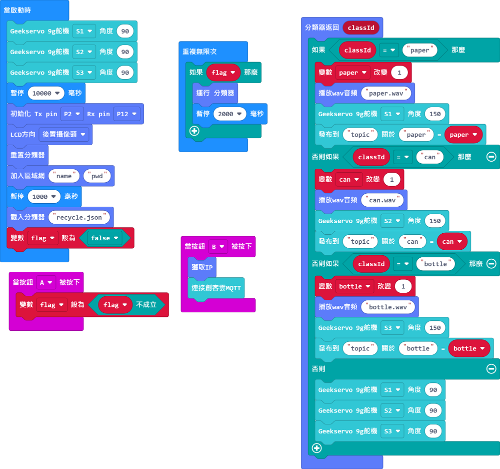

# AI/AIoT 智能回收箱套件教學

## 模型訓練參考程式

[Armourbit版參考程式](https://makecode.microbit.org/_41yHDg4PfVsg)

### 訓練方法

1. 按A對廢紙進行訓練。
2. 按B對鋁罐進行訓練。
3. 按A+B對膠樽進行訓練。
4. 按KOI的B鍵對背景進行訓練。
5. 按KOI的A鍵儲存模型。

## AI智能回收箱參考程式

[音效檔下載](http://gofile.me/2MRnk/9eN5byCsA)

[Armourbit版參考程式](https://makecode.microbit.org/_EErK8LD3U4zr)

[Robotbit版參考程式](https://makecode.microbit.org/_7x9XHo1Wpa0T)

### 辨認方法

1. 按A啟動辨認功能。
2. KOI會說出辨認到的垃圾類別，然後打開相應的回收箱。

## AIoT智能回收箱參考程式

### IoT參考程式使用了MakerCloud平台

[音效檔下載](http://gofile.me/2MRnk/9eN5byCsA)

[Armourbit版參考程式](https://makecode.microbit.org/_J0b5kYWjuYhF)

[Robotbit版參考程式](https://makecode.microbit.org/_Ydyf8P86t9C3)

### 辨認方法

1. 按A啟動辨認功能。
2. 按B確認KOI已成功連接網絡，並連接MakerCloud平台。
3. KOI會說出辨認到的垃圾類別，然後打開相應的回收箱。