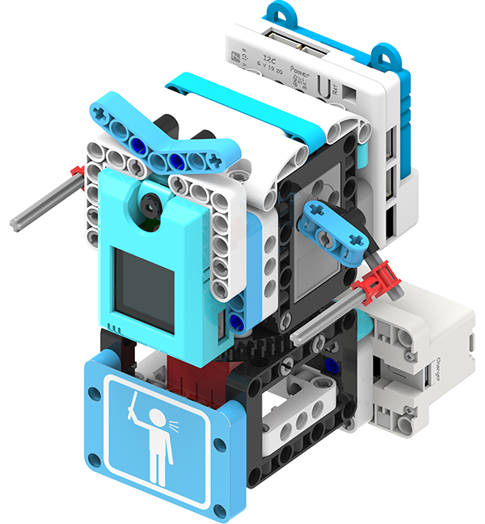
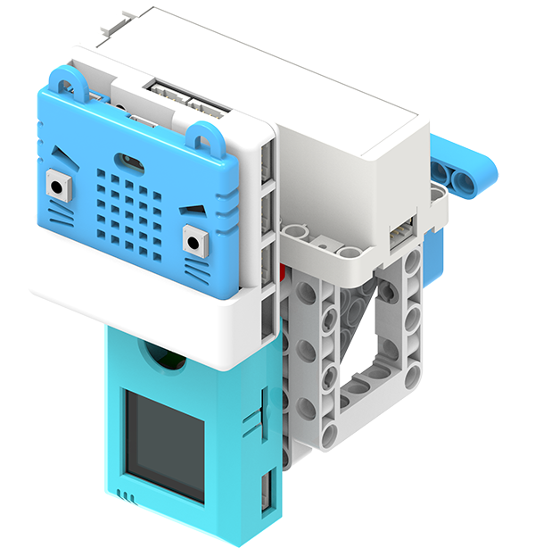

# AI衛生防疫套件介紹

### AI衛生防疫套件 (HKBK8043A)

## 產品背景

新型冠狀病毒的疫情嚴重性，令市民大眾的抗疫意識大大提高，
大家都明白做好抗疫工作的重要性。有見及此，Kittenbot推出了AI衛生防疫套件，
舉出多款防疫案例，讓學生學習防疫措施之餘亦學習人工智能與我們日常生活的關係。

## AI衛生防疫套件內容

- Armourbit擴展板x1
- Armourbit電池盒x1
- 2KG舵機 x2
- 2KG電機 x2
- KOI AI鏡頭 x1
- 紅外線測溫模塊 x1
- 18650鋰電池x1
- 全彩點陣魔塊 x1
- 水泵+水箱 x1
- 4pin防反插排線 x4
- 3pin防反插排線 x1
- 1m USB數據線 x1
- 200件積木包 x1
- 巡線黑膠帶 x1
- 說明書 x1
- Microbit矽膠保護套x1
- 裝飾膠片x1
- SD卡 (256MB) x1

## 防疫案例介紹

### AI酒精搓手液機

利用機器學習偵測手掌，遇見手掌時泵出洗手液。

### 手提探溫槍

手提紅外線測溫槍。

### 自動追踪探溫器

自動追蹤人臉，遇見人臉時進行紅外線測溫。

### 防疫用品指揮官

利用機器學習，辨認防疫用品。

### 口罩佩戴偵測器

利用機器學習，只為有佩戴口罩人士打開閘門。

### 無按鈕電梯

利用機器學習，辨識手勢控制升降機。

### 非接觸式門鈴

偵測到人臉時按下門鈴。

### 無人外賣車

利用視覺巡線追蹤，實現無人駕駛。

檢測條碼確認身份，只讓經確認人士提取外賣。

### 智能模擬UV消毒燈

利用機器學習，辨認物品進行消毒。

