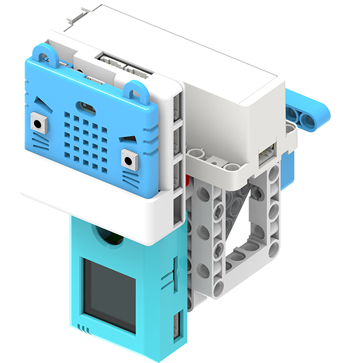
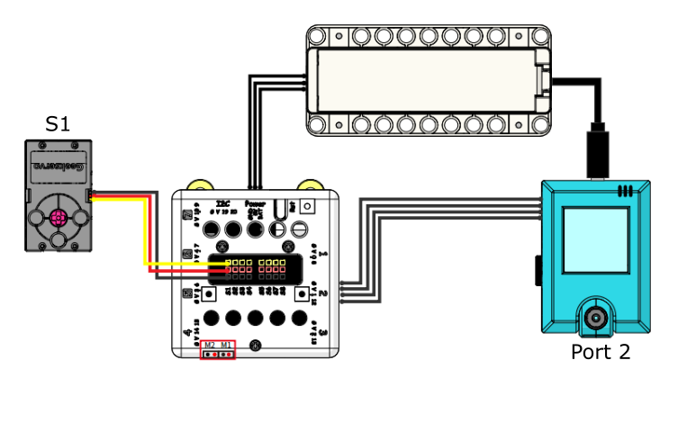
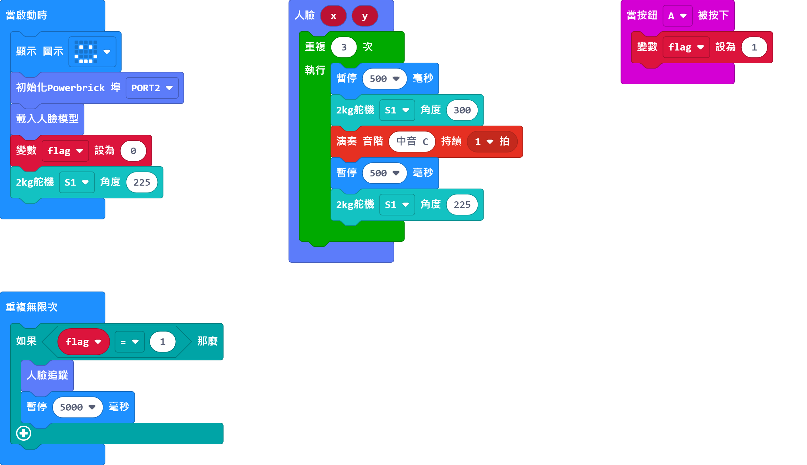

# 非接觸式門鈴說明書

在抗疫期間，大家都會盡量避免觸摸公用物件，以免沾上病毒。有見及此，這案例模擬了一台非接觸式門鈴，讓乘客不用觸摸按鈕也可以使用門鈴。

## 教材資源包下載

包括說明書： [資源包下載地址](https://bit.ly/AIHealthCareSetBuildingGuide)

## 參考接線

## 參考程式

[非接觸式門鈴參考程式](https://makecode.microbit.org/_JgMWAaiD3Y4c)

[參考程式資源包下載地址](https://bit.ly/AIHealthCareSetHex)

## 模型玩法

打開電源後，重置Microbit。

按下A按鍵，鏡頭會開始追蹤人臉。

偵測到人臉之後模型就會按下門鈴。

