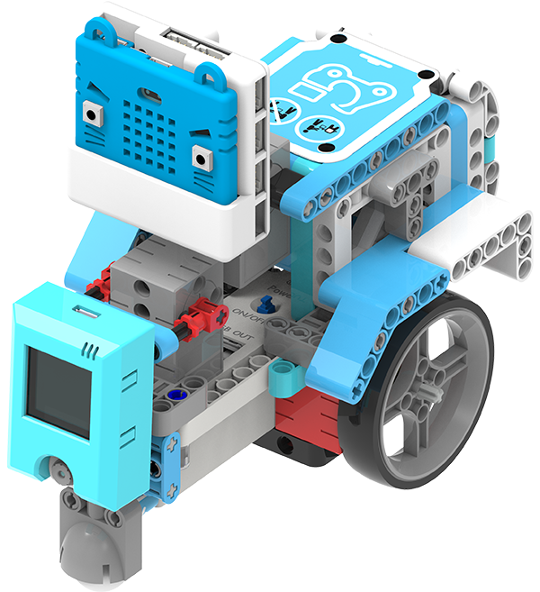
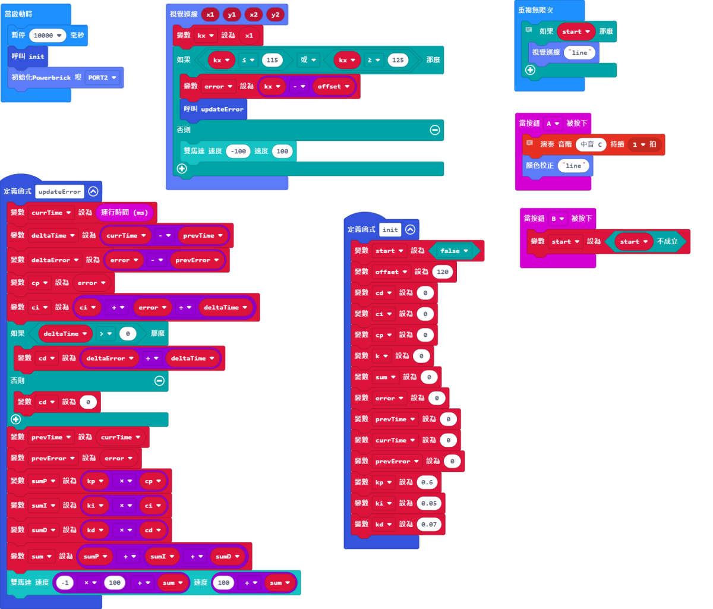

# 無人外賣車說明書

在抗疫期間，購買外賣都成為很多市民的日常，可是送遞外賣仍然存有人與人的接觸，難免有風險。所以這案例構思了一輛無人駕駛的外賣車，模擬無人配送的操作。

## 教材資源包下載

包括說明書： [資源包下載地址](https://bit.ly/AIHealthCareSetBuildingGuide)

## 參考接線

## 參考程式

### 巡線模式：

[無人外賣車巡線模式參考程式__KOI固件版本1.12.0__插件版本0.6.7](https://makecode.microbit.org/_KWdgwY9UWMms)

### 條碼模式：

[無人外賣車條碼模式參考程式__KOI固件版本1.12.0__插件版本0.6.7](https://makecode.microbit.org/_UbYMTY437DmV)

## 模型玩法

### 巡線模式：

1. 打開電源後，等待10秒讓KOI完全開機。

2. 將無人車放在黑線上，按下A按鍵，進行顏色校正。

3. 完成後按下B按鍵，無人車會沿著黑線行走。

### 條碼模式：

1. 打開電源後，等待10秒讓KOI完全開機。

2. 將無人車放在桌面，車子會向前行走。

3. 將二維碼放在鏡頭面前，假如偵測到內容為1或者2的二維碼，無人車會打開外賣箱。

