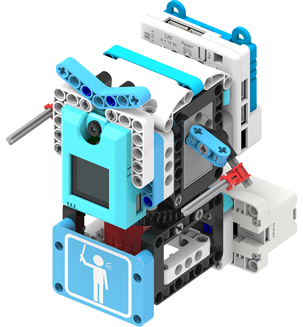
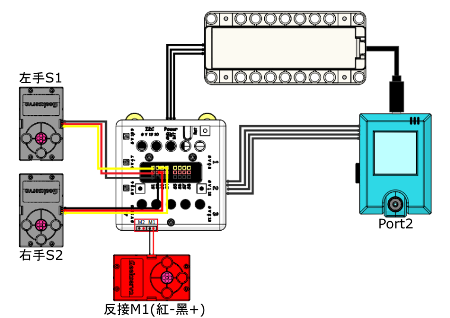
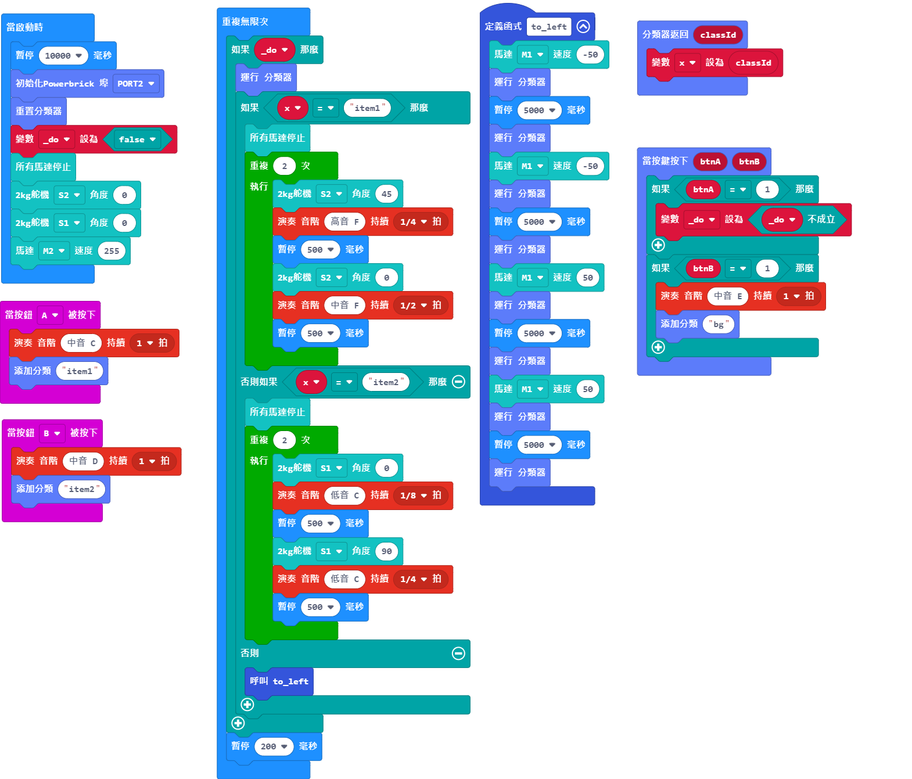

# 防疫用品指揮官說明書

在抗疫期間，大家都會攜帶不同的防疫用品，例如消毒搓手液等。這個案例模擬了有關防疫用品的檢測，提醒大家攜帶足夠的防疫用品。

## 教材資源包下載

包括說明書： [資源包下載地址](https://bit.ly/AIHealthCareSetBuildingGuide)

## 參考接線

## 參考程式

[防疫用品指揮官參考程式__KOI固件版本1.12.0__插件版本0.6.7](https://makecode.microbit.org/_eARTT7LuVaHW)

## 模型玩法

1. 打開電源後，等待10秒讓KOI完全開機。

2. 按下A按鍵，對第一件物件進行訓練，重複大約3次。

3. 按下B按鍵，對第二件物件進行訓練，重複大約3次。

4. 按下KOI的B按鍵，對背景進行訓練，轉動模型改變角度，再按下KOI的B按鍵訓練背景。重複大約3次。

5. 按下KOI的A按鍵，指揮官會轉動，將已訓練的物件放在鏡頭面前，指揮官會揮動手臂。

