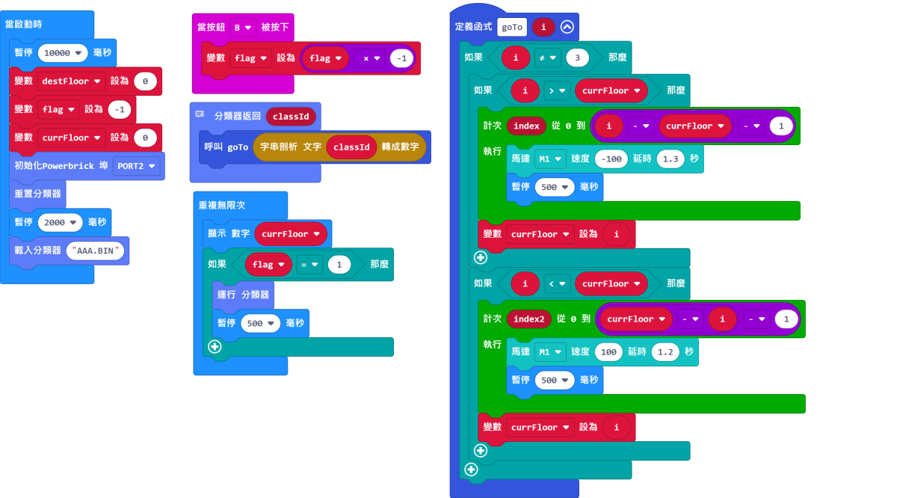

# 無按鈕電梯說明書

在抗疫期間，大家都會盡量避免觸摸公用物件，以免沾上病毒。有見及此，這案例模擬了一台非接觸式升降機，讓乘客不用觸摸按鈕也可以使用升降機。

## 教材資源包下載

包括說明書： [資源包下載地址](https://bit.ly/AIHealthCareSetBuildingGuide)

## 參考接線

## 參考程式

[參考程式資源包下載地址](https://bit.ly/AIHealthCareSetHex)

## 模型玩法

### 首先載入訓練程序

打開電源後，重置Microbit。

做出G樓的手勢，對準鏡頭然後按下B按鍵，重複大約3次然後按下A按鍵完成訓練。

使用同樣方法訓練1樓和2樓的手勢。

最後走出鏡頭範圍，對背景進行訓練。

完成所有訓練之後同時按下A和B按鍵，儲存訓練的檔案。

### 然後載入升降機程序

打開電源，重置Microbit。

按下B按鍵，模型會開始辨識手勢。

對鏡頭做出相應手勢，升降機就會移動到相應樓層。

