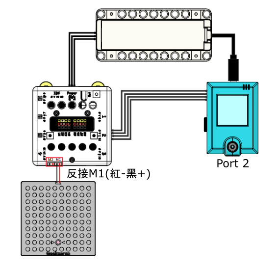
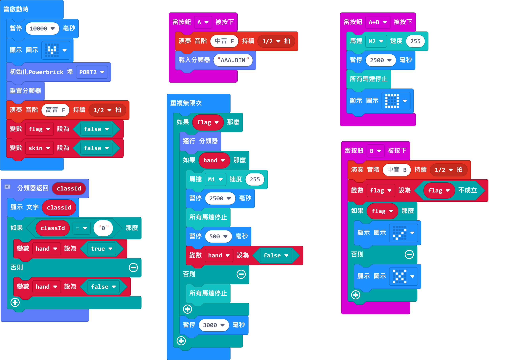

# AI酒精搓手液機說明書

在抗疫期間，大家都會自動自覺常洗手，這案例模擬了智能洗手機的操作。

## 教材資源包下載

包括說明書： [資源包下載地址](https://bit.ly/AIHealthCareSetBuildingGuide)

## 參考接線

## 參考程式

[訓練程序參考程式](https://makecode.microbit.org/_4v35X9ferVMY)

[搓手液機參考程式](https://makecode.microbit.org/_Dzp8Xt48kMVq)

[參考程式資源包下載地址](https://bit.ly/AIHealthCareSetHex)

## 模型玩法

### 首先載入訓練程序

打開電源後，重置Microbit。

擺出手掌，對準鏡頭然後按下B按鍵，重複大約3次然後按下A按鍵。

走出鏡頭範圍，按下B按鍵對背景進行訓練。

完成所有訓練之後同時按下A和B按鍵，儲存訓練的檔案。

### 然後載入搓手液機程序

打開電源，重置Microbit。

按下A按鍵然後按下B按鍵，模型會開始辨識手掌。

偵測到手掌之後，水泵會泵出少量消毒火酒。

按下B按鍵可以暫停偵測。

