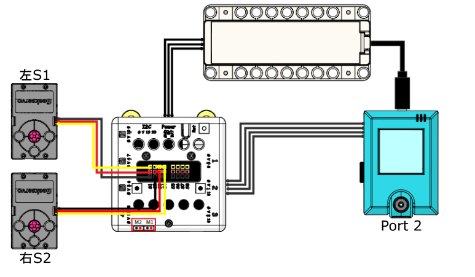

# 口罩佩戴偵測器說明書

在抗疫期間，佩戴口罩成為市民大眾的習慣，不同場所也規定要佩戴口罩才可入內。這個案例模擬了口罩檢測閘門，只許有口罩的人士進入。

## 教材資源包下載

包括說明書： [資源包下載地址](https://bit.ly/AIHealthCareSetBuildingGuide)

## 參考接線

## 參考程式

[口罩佩戴偵測器參考程式](https://makecode.microbit.org/_3i3Dwm7Fm7w1)

[參考程式資源包下載地址](https://bit.ly/AIHealthCareSetHex)

## 模型玩法

打開電源後，重置Microbit。

戴上口罩，將鏡頭準自己然後按下A按鍵進行訓練，重複大約3次。

除下口罩，將鏡頭準自己然後按下B按鍵進行訓練，重複大約3次。

按下KOI的B按鍵，對背景進行訓練。

按下KOI的A按鍵，KOI偵測到戴上口罩的人臉時，大閘會打開。

