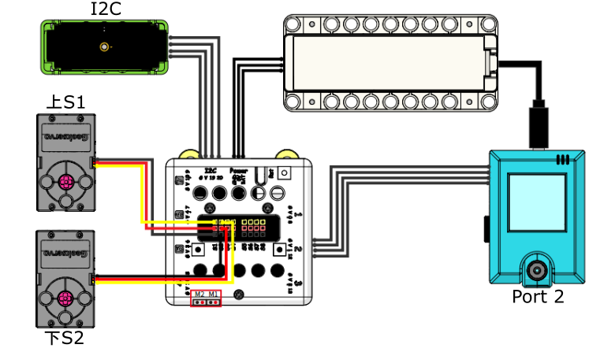
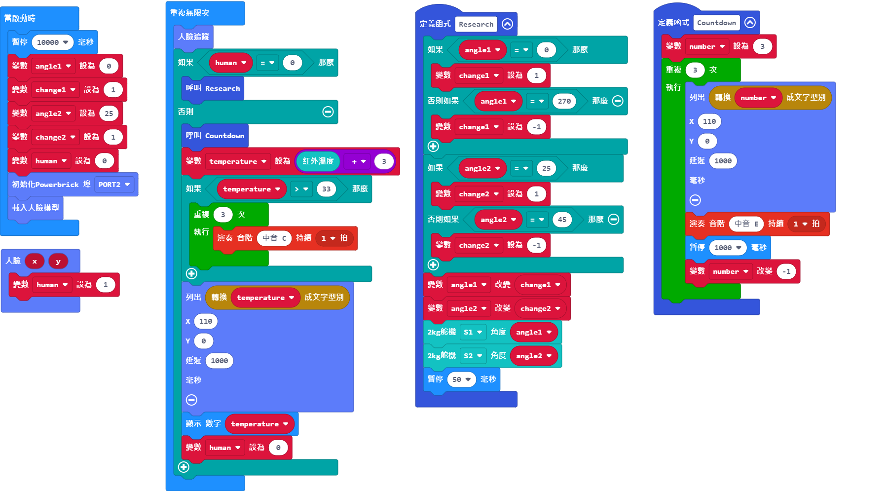

# 自動追踪探溫器說明書

在抗疫期間，測量體溫是抗疫工作之中最普遍的一環，大家在進入餐廳甚至辦公室之前都會先測量體溫。這個案例模擬了無人測溫槍的運作。

## 教材資源包下載

包括說明書： [資源包下載地址](https://bit.ly/AIHealthCareSetBuildingGuide)

## 參考接線

## 參考程式

[自動追踪探溫器參考程式](https://makecode.microbit.org/_LRc0Aa7r2gJx)

[參考程式資源包下載地址](https://bit.ly/AIHealthCareSetHex)

## 模型玩法

打開電源後，重置Microbit。

測溫器會慢慢轉動，探測人面。

偵查到人面之後會停下來倒數3秒進行測溫。

測出的溫度會顯示在點陣屏和KOI上。

