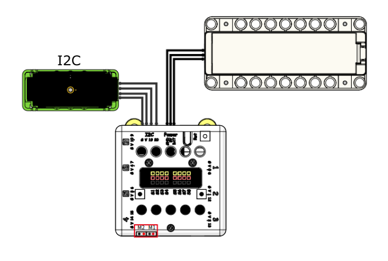

# 手提探溫槍說明書

在抗疫期間，測量體溫是抗疫工作之中最普遍的一環，大家在進入餐廳甚至辦公室之前都會先測量體溫。這個案例模擬了一般測溫槍的運作。

## 教材資源包下載

包括說明書： [資源包下載地址](https://bit.ly/AIHealthCareSetBuildingGuide)

## 參考接線

## 參考程式

[參考程式資源包下載地址](https://bit.ly/AIHealthCareSetHex)

## 模型玩法

打開電源後，拿著測溫槍，對著額頭距離大約3cm，拉動扳機。

成功測溫時會亮起綠燈，點陣屏以攝氏列出體溫。
