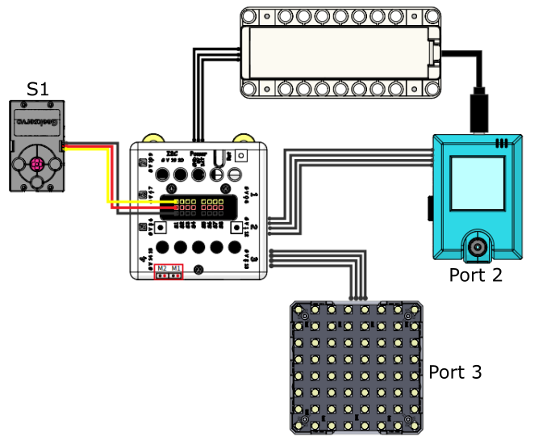
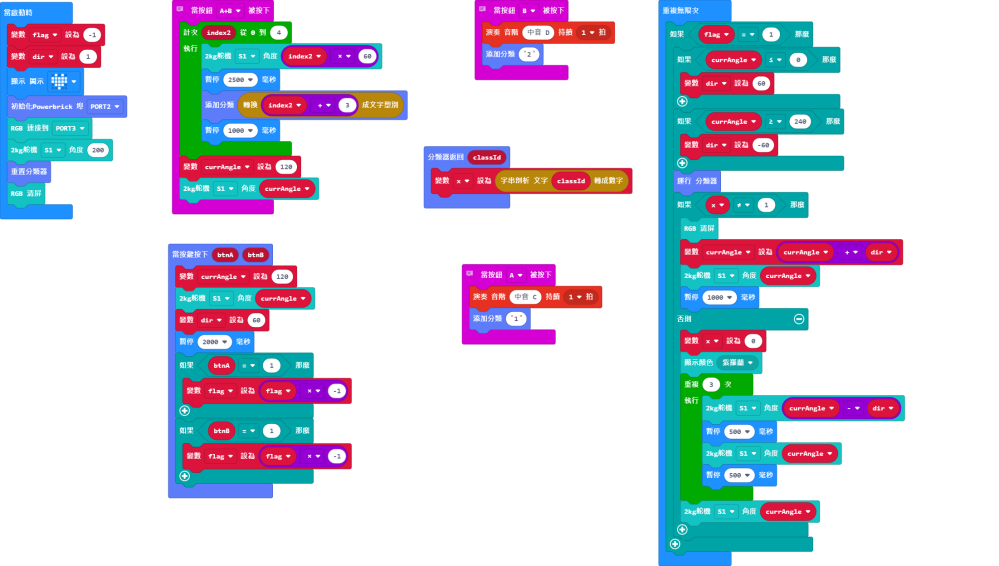

# 智能模擬UV消毒燈說明書

在抗疫期間，為物件消毒是重要的動作，這案例是模擬了紫外線消毒燈的操作。

## 教材資源包下載

包括說明書： [資源包下載地址](https://bit.ly/AIHealthCareSetBuildingGuide)

## 參考接線

## 參考程式

[智能模擬UV消毒燈參考程式__KOI固件版本1.12.0__插件版本0.6.7](https://makecode.microbit.org/_FmF1vLbmLfgX)

## 模型玩法

1. 打開電源後，等待10秒讓KOI完全開機。

2. 按下A按鍵，對第一件物件進行訓練，重複大約3次。

3. 按下B按鍵，對第二件物件進行訓練，重複大約3次。

4. 同時按下A和B按鍵，走出鏡頭範圍。模型會自行對背景進行訓練。

4. 按下KOI的A或B按鍵，模型會轉動。

6. 將訓練過的物件放在鏡頭面前，辨識到之後消毒燈會點亮和擺動。

