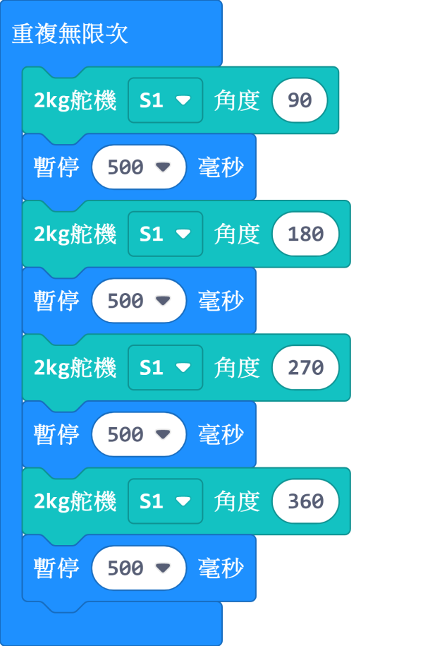
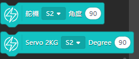
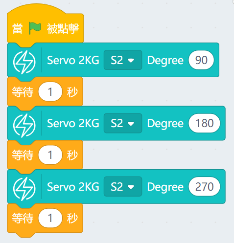

# GeekServo 2KG舵機

2KG舵機 (HKBD8008A)

這是一款兼容樂高插孔的高扭力的舵機，相對於9g舵機，在同等供電下具有更高扭力。輸出軸為兩組樂高十字孔，主要用在需求精細控制的結構上。

## 產品參數

- 工作電壓：3.3V~6V
- 額定電壓：4.8V
- 額定電流：70mA
- 堵轉電流：900mA   
- 打滑電流：700mA
- 最大扭力：1.6kg±0.2kg/cm(4.8V)
- 角度轉速：60°/0.14s
- 角度範圍：0°~360°
- 重量：20g
- 接口：橙紅啡線

## 規格尺寸

### 樂高孔單位:

- 長度：5孔
- 闊度：3孔
- 高度：3孔
- 輸出軸：樂高十字軸

### mm單位:

- 長度：40mm
- 闊度：24mm
- 高度：24mm
- 輸出軸：樂高十字軸

## 接線方法

    啡色接負極，紅色接正極，橙色接數據
    
## MakeCode編程教學

加載PowerBrick插件：https://github.com/KittenBot/pxt-powerbrick

### 舵機積木塊:

### 舵機編程

## KittenBlock編程教學

### 加載PowerBrick插件

離線版與在線版同樣操作。

在左上角小貓logo旁邊的硬件欄選擇PowerBrick，加載Microbit與Powerbrick插件。

### 舵機積木塊

### 舵機編程

[參考程式下載](https://bit.ly/PowerbrickM12_01sb3)

## FAQ

1：為什麼我點擊積木塊沒有反應呢？

首先確保已經連接好Microbit，然後上載韌體再試一試。